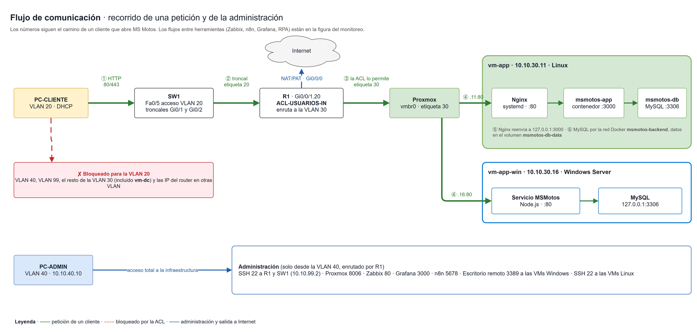
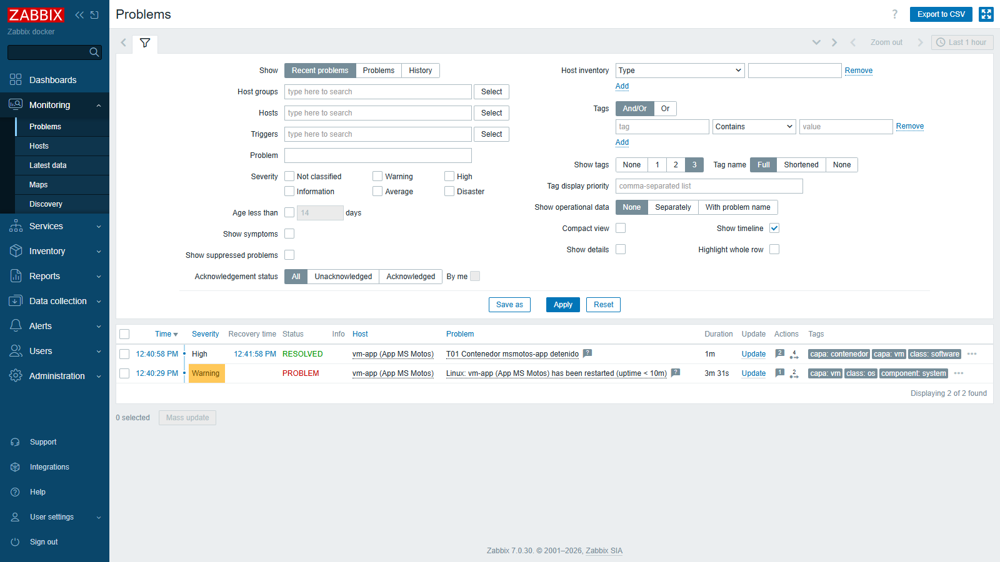
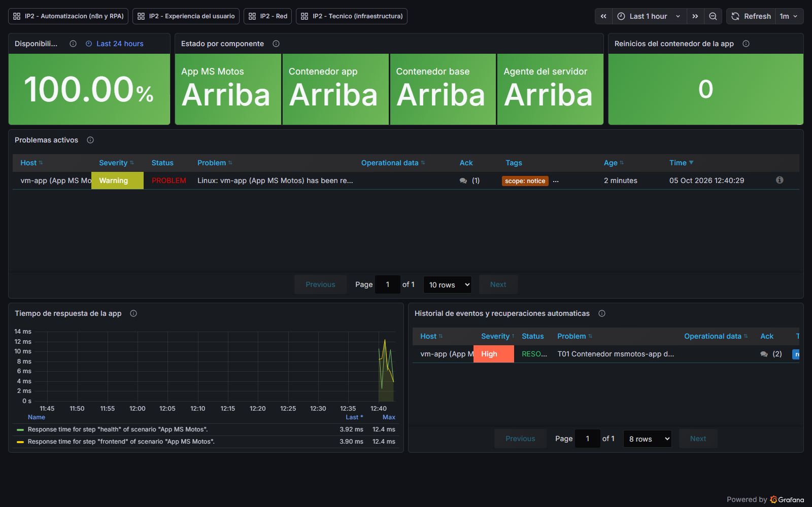
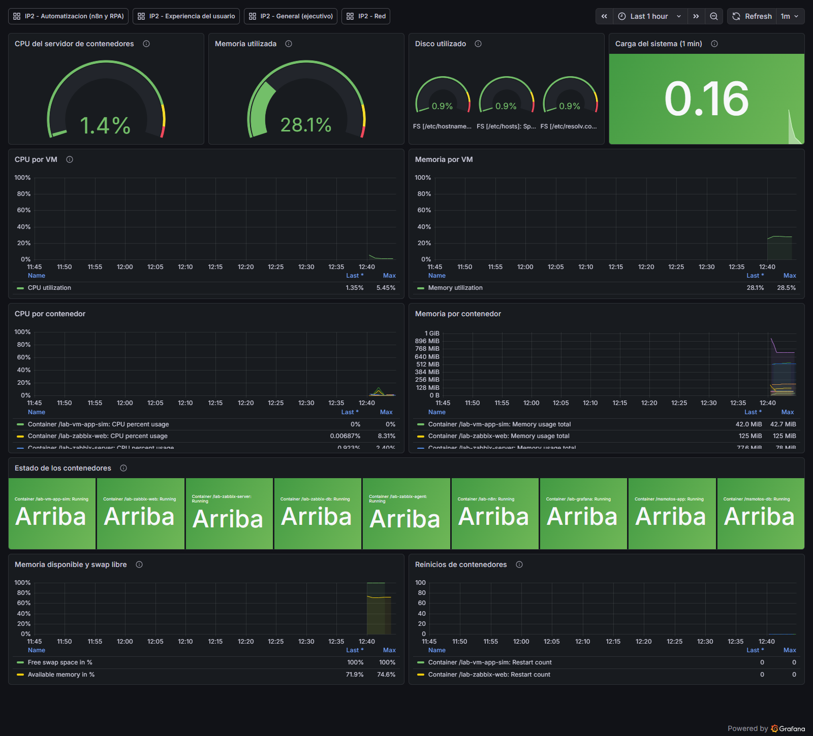

# Entregable #2 — Análisis y diseño de la solución

**Propósito:** convertir los requerimientos del Entregable #1 en una arquitectura técnica completa, justificando las tecnologías y las decisiones de diseño.

El documento sigue el orden del contenido obligatorio de la *Guía de contenido, rúbrica y criterios de aceptación* del Entregable #2. Las secciones 1 a 10 corresponden una a una a los diez puntos de la guía:

| Punto de la guía | Sección | Criterio de la rúbrica | Peso |
|---|---|---|---|
| Correcciones del Entregable #1 | 1 | — | — |
| Arquitectura física y lógica | 2 | Arquitectura física y lógica | 20 % |
| Diseño de red | 3, y la seguridad en la 11 | Diseño de red y seguridad básica | 20 % |
| Diseño de virtualización | 4 | Virtualización y contenedores | 15 % |
| Diseño de contenedores | 5 | Virtualización y contenedores | 15 % |
| Diseño de monitoreo | 6 | Diseño de monitoreo y observabilidad | 15 % |
| Diseño de observabilidad | 7 | Diseño de monitoreo y observabilidad | 15 % |
| Automatización y alertamiento | 8 | Automatización y RPA | 15 % |
| RPA / monitoreo sintético | 9 | Automatización y RPA | 15 % |
| Análisis comparativo y costo/beneficio | 10 | Comparación y costo/beneficio | 10 % |

Después vienen la seguridad y ciberseguridad de la plataforma, que el profesor pidió reforzar (sección 11), los criterios y pruebas de aceptación A-01 a A-07 (sección 12), la trazabilidad con los requerimientos, que sostiene el criterio de coherencia documental (sección 13), lo que ya está validado (14), los riesgos (15), las respuestas a las preguntas orientadoras (16) y los próximos pasos (17). El **Anexo A** lista las evidencias.

Los tres cambios que el profesor pidió el 5 de octubre al revisar el avance están aplicados y se resumen en la sección 1.2.

## Resumen de la solución

La plataforma corre sobre el equipo que presta la universidad: un router **Cisco ISR 4221**, un switch **Catalyst WS-C2960-24TT-L** y un servidor físico con **Proxmox VE**. La red se divide en cuatro VLAN (Administración, Usuarios, Servidores y Gestión) más una nativa sin uso, y los usuarios solo alcanzan la aplicación.

En el servidor corren **siete máquinas virtuales**: MS Motos en Linux con Docker, MS Motos en Windows Server como servicio, Zabbix, Grafana, n8n, el robot del monitoreo sintético y el controlador de dominio. Zabbix vigila todas las capas; cuando algo se cae y la causa es conocida, n8n lo recupera y avisa por Telegram y correo; cuando el problema es de capacidad, solo avisa.

| Elemento | Cantidad |
|---|---|
| VLAN | 4 en uso (20, 30, 40, 99) + nativa 999 |
| Máquinas virtuales | 7: cinco Linux y dos Windows Server 2022 |
| Ambientes de MS Motos | 2: Linux (contenedores) y Windows (servicio nativo) |
| Triggers de Zabbix | 24: de T01 a T20, más las variantes T03-W, T09-G, T09b y T11b |
| Fallas que se recuperan solas | 6 |
| Dashboards de Grafana | 5 |
| Recorridos del cliente sintético | 2, cada uno contra las dos instancias |
| Capas con controles de seguridad | 8, de la red a la aplicación (sección 11) |

## 1. Correcciones del Entregable #1

### 1.1 Retroalimentación del Entregable #1 (21 de setiembre)

El profesor revisó el E1 el 21 de setiembre de 2026 y dejó observaciones en cuatro rondas. Todas se incorporaron a los requerimientos en la **versión 1.5 del E1** y se desarrollan en este diseño:

| # | Observación del profesor | Qué se cambió | Dónde |
|---|---|---|---|
| 1 | La aplicación debe correr en un ambiente **Windows Server** y en uno **Linux** | Segundo ambiente: MS Motos instalada como servicio en Windows Server 2022, además de la versión en contenedores. Nuevos RF-19 y RF-20 | Secciones 4 y 5.6 |
| 2 | El RPA debe medir la **experiencia del cliente**, con el tipo de experiencia definido en los requerimientos | El usuario sintético pasa a ser un cliente del portal, con dos recorridos definidos: consulta y agendamiento. Nuevos RF-16 a RF-18 | Sección 9 |
| 3 | Aclarar **cuántos dashboards** hay | Cinco dashboards, con la pregunta que responde cada uno y su audiencia | Sección 7 |
| 4 | Agregar **Active Directory** para la validación de usuarios y la seguridad | Controlador de dominio `ip2.local`, grupos por rol y política de contraseñas. Nuevos OE-9, RF-21, RF-22 y RNF-09 | Sección 3.8 |
| 5 | **CI/CD no forma parte** del proyecto | Se descarta Jenkins; el quinto dashboard muestra los flujos de n8n y el RPA en lugar de *pipelines* | Secciones 7 y 10.5 |
| 6 | Los dashboards le parecieron **cargados** | Se empieza con cinco y se divide el que quede cargado | Sección 7 |
| 7 | Ante un evento de red, **reiniciar el dispositivo de forma automática** (aclaró: "con la automatización", no con autorización) | Recuperación automática de interfaces, puertos y equipos, con límites y exclusiones. Nuevos RF-23 y RNF-10 | Sección 8.3 |

Además del profesor, el inventario del laboratorio (IP2-14, fotos del 21 de setiembre) corrigió un supuesto del E1:

| Supuesto del E1 | Equipo real | Efecto |
|---|---|---|
| Router Cisco 2911 | **ISR 4221 con IOS XE** | Cambian los nombres de interfaz (Gi0/0 → **Gi0/0/0**, Gi0/1 → **Gi0/0/1**), no la lógica. Para el ensayo se usa un ISR4321 en Packet Tracer, que tiene los mismos nombres |
| Switch 2960 | **WS-C2960-24TT-L, IOS 12.2(50)SE5** | Coincide con el diseño; la configuración no cambia |

Como consecuencia, el diseño pasó de 5 a **7 máquinas virtuales** y de 16 a **24 GB de RAM** asignados.

### 1.2 Revisión del avance del Entregable #2 (5 de octubre)

Al revisar el avance de este entregable, el profesor pidió tres cambios antes de recibirlo. Los tres están aplicados:

| # | Observación del profesor | Qué se cambió | Dónde |
|---|---|---|---|
| 1 | Usar otra VLAN que no sea la **VLAN 10** | La VLAN de Administración pasa de la 10 a la **VLAN 40**, con la red 10.10.40.0/24. Se actualizaron el direccionamiento, los troncales, las subinterfaces, las ACL, los tres diagramas y las configuraciones de `red/` | Secciones 2.2 y 3.1 a 3.5; figuras 1 a 3 |
| 2 | Montar la aplicación **también en un Windows Server** | El segundo ambiente ya formaba parte del diseño (RF-19). Se amplió para que quede completo: qué se instala, cómo se configura el servicio de Windows y cómo se protege y se monitorea | Secciones 4.2, 5.6 y 11.3 |
| 3 | Trabajar en la **seguridad y ciberseguridad** del proyecto | Sección nueva con las amenazas, los controles por capa, el firewall de cada VM, el manejo de secretos, la detección y respuesta, y las pruebas de seguridad. Tres triggers nuevos (T18 a T20), el criterio CA-16 y cinco tareas (IP2-88 a IP2-92) | Sección 11; también 3.6, 6.4 y 12.2 |

El cambio de VLAN no altera la lógica de la red: solo el número y el tercer octeto de la red de Administración. Los ensayos de Packet Tracer se hicieron con la VLAN 10 y se repiten con la 40 (3.9).

## 2. Arquitectura física y lógica

Tres diagramas, uno por vista: la física (figura 1), la lógica (figura 2) y el flujo de comunicación (figura 3). Van juntos en páginas horizontales al final de esta sección, para que se lean a tamaño completo.

### 2.1 Arquitectura física (figura 1)

| Equipo | Modelo | Interfaces que se usan | Función |
|---|---|---|---|
| R1 | Cisco ISR 4221, IOS XE | Gi0/0/0 hacia la red de la universidad · Gi0/0/1 en troncal hacia SW1 | Enrutamiento entre VLAN, NAT/PAT, DHCP de usuarios, ACL |
| SW1 | Catalyst WS-C2960-24TT-L, IOS 12.2(50)SE5 | Gi0/1 troncal a R1 · Gi0/2 troncal al servidor · Fa0/1–24 acceso | VLAN, troncales, seguridad de puertos |
| Servidor | Por confirmar en la visita (IP2-14) | Una NIC en troncal a SW1 Gi0/2 | Proxmox VE y las siete VMs |
| PC-ADMIN | PC del laboratorio | SW1 Fa0/1 | Administración de toda la plataforma |
| PC-CLIENTE | PC del laboratorio | SW1 Fa0/5 | Representa a un usuario o cliente |

El módulo NIM-2T de dos seriales que trae el router no se usa. En el rack hay tres ISR 4221 y varios 2960 compartidos entre grupos, así que en la primera visita se acuerda con el profesor cuáles son del grupo y se etiquetan (riesgo R-01).

### 2.2 Arquitectura lógica (figura 2)

| VLAN | Nombre | Red | Gateway | Qué hay |
|---|---|---|---|---|
| 20 | USUARIOS | 10.10.20.0/24 | 10.10.20.1 | PC de usuarios, DHCP de .100 a .200 |
| 30 | SERVIDORES | 10.10.30.0/24 | 10.10.30.1 | Proxmox y las siete VMs, con IP fija |
| 40 | ADMINISTRACION | 10.10.40.0/24 | 10.10.40.1 | PC de administración, con IP fija |
| 99 | GESTION | 10.10.99.0/24 | 10.10.99.1 | IP de gestión del switch |
| 999 | NATIVA-SIN-USO | — | — | VLAN nativa de los troncales y puertos apagados |

### 2.3 Flujo de comunicación (figura 3)

La figura 3 sigue a un cliente que abre MS Motos: sale de la VLAN 20, sube por el troncal a R1, la ACL deja pasar solo HTTP y HTTPS hacia las dos instancias, vuelve por el troncal a la VLAN 30 y entra por el bridge de Proxmox a la VM. En Linux atraviesa Nginx, el contenedor de la aplicación y la base de datos; en Windows, el servicio de la aplicación y MySQL.

La tabla completa de flujos, incluidos los de las herramientas entre sí (la figura 4, en la sección 6, los muestra desde el punto de vista del monitoreo):

| Origen | Destino | Protocolo y puerto | Para qué |
|---|---|---|---|
| Clientes (VLAN 20) | `vm-app` y `vm-app-win` | TCP 80 / 443 | Usar MS Motos |
| Nginx | `msmotos-app` | TCP 3000 en `127.0.0.1` | Proxy hacia la aplicación |
| `msmotos-app` | `msmotos-db` | TCP 3306 en la red Docker | Datos |
| PC-ADMIN (VLAN 40) | R1 y SW1 | SSH 22 | Administración de la red |
| PC-ADMIN | Proxmox · VMs Linux · VMs Windows | HTTPS 8006 · SSH 22 · Escritorio remoto 3389 | Administración de servidores |
| PC-ADMIN | Zabbix · Grafana · n8n | HTTP 80 · 3000 · 5678 | Consolas de las herramientas |
| `vm-zabbix` | R1 y SW1 | SNMP UDP 161 | Métricas de red |
| Agentes de las VMs | `vm-zabbix` | TCP 10051 (agente activo) | Métricas de sistema, contenedores y servicios |
| `vm-zabbix` | Proxmox | HTTPS 8006 (API) | Métricas del servidor físico |
| `vm-zabbix` y `vm-rpa` | Las dos instancias | HTTP 80 | Escenarios web y recorridos del cliente |
| `vm-rpa` y `vm-n8n` | `vm-zabbix` | TCP 10051 (*trapper*) | Resultados del RPA y de la automatización |
| `vm-zabbix` | `vm-n8n` | HTTP 5678 (webhook con token) | Disparar una remediación |
| `vm-n8n` | `vm-app` · `vm-app-win` · R1 y SW1 | SSH 22 · WinRM 5985 · SSH 22 | Ejecutar la acción de recuperación |
| `vm-n8n` | Telegram y correo | HTTPS 443 · SMTP 587, por NAT | Notificar |
| `vm-grafana` | `vm-zabbix` | HTTP 80 (API) | Leer métricas para los dashboards |
| Zabbix, Grafana, Proxmox | `vm-dc` | LDAP 389 | Validar usuarios del dominio |
| VMs unidas al dominio | `vm-dc` | DNS 53 · Kerberos 88 | Resolución y autenticación del dominio |

<div class="figura-h">
<figure><figcaption>Figura 1 · Arquitectura física: qué se cablea con qué. Fuente editable: docs/diagramas/arquitectura-fisica.drawio</figcaption></figure>
</div>

<div class="figura-h">
<figure><figcaption>Figura 2 · Arquitectura lógica: segmentación y tráfico permitido. Fuente editable: docs/diagramas/arquitectura-logica.drawio</figcaption></figure>
</div>

<div class="figura-h">
<figure><figcaption>Figura 3 · Flujo de comunicación: recorrido de una petición de un cliente, tráfico bloqueado y administración. Fuente editable: docs/diagramas/flujo-comunicacion.drawio</figcaption></figure>
</div>

## 3. Diseño de red

### 3.1 Direccionamiento

| Equipo | VLAN | IP | Observación |
|---|---|---|---|
| R1 | 20, 30, 40, 99 | `.1` de cada red | Gateway de cada VLAN |
| SW1 | 99 | 10.10.99.2 | SSH y SNMP del switch |
| PC-ADMIN | 40 | 10.10.40.10 | IP fija |
| Proxmox | 30 | 10.10.30.10 | Panel web en el puerto 8006 |
| vm-app | 30 | 10.10.30.11 | MS Motos en Linux; visible para usuarios en 80/443 |
| vm-zabbix | 30 | 10.10.30.12 | Único origen SNMP permitido |
| vm-grafana | 30 | 10.10.30.13 | |
| vm-n8n | 30 | 10.10.30.14 | Único origen SSH de automatización hacia los equipos de red |
| vm-rpa | 30 | 10.10.30.15 | Recorre las dos instancias |
| vm-app-win | 30 | 10.10.30.16 | MS Motos en Windows; visible para usuarios en 80/443 |
| vm-dc | 30 | 10.10.30.17 | Active Directory y DNS; **no** visible para usuarios |
| Clientes | 20 | 10.10.20.100 a .200 | Por DHCP desde R1; se excluyen .1–.99 y .201–.254 |

### 3.2 Puertos de acceso y troncales

| Puerto | Modo | VLAN | Conecta a |
|---|---|---|---|
| Gi0/1 | Troncal 802.1Q | 20, 30, 40, 99 · nativa 999 | R1 Gi0/0/1 |
| Gi0/2 | Troncal 802.1Q | 30, 99 · nativa 999 | Servidor Proxmox |
| Fa0/1 – Fa0/4 | Acceso | 40 | PC de administración |
| Fa0/5 – Fa0/12 | Acceso | 20 | PC de usuarios |
| Fa0/13 – Fa0/20 | Acceso | 30 | Reservados para servidores |
| Fa0/21 – Fa0/24 | Apagados | 999 | Sin uso |

Todos los puertos de acceso llevan `spanning-tree portfast` y `bpduguard`. Los de usuarios, además, seguridad de puerto con un máximo de dos direcciones MAC en modo *restrict*.

**Por qué VLAN 99 y 999:** la gestión del switch no comparte red con los usuarios, y la VLAN nativa de los troncales es la 999, que no lleva tráfico, en lugar de la 1. Así se evita el salto de VLAN por doble etiquetado.

### 3.3 Enrutamiento

| Tramo | Cómo se enruta |
|---|---|
| Entre VLAN | **Router-on-a-stick:** R1 tiene una subinterfaz por VLAN en Gi0/0/1 (`.20`, `.30`, `.40`, `.99`, más `.999` nativa sin IP). Las cuatro redes son directamente conectadas, así que R1 las enruta sin configuración adicional |
| Hacia Internet | La ruta por defecto llega por **DHCP** en Gi0/0/0 desde la red de la universidad (`ip address dhcp`). En el ensayo de Packet Tracer se usa una ruta estática `0.0.0.0/0` hacia el ISP simulado |
| Gestión del switch | `ip default-gateway 10.10.99.1`: el switch responde a SSH y SNMP desde otras VLAN a través de R1 |
| Servidores | Todas las VMs usan `10.10.30.1` como gateway |

**Por qué router-on-a-stick y no un switch de capa 3:** el 2960 con IOS 12.2(50)SE5 no enruta entre VLAN. **Por qué no un protocolo de enrutamiento dinámico** (OSPF, EIGRP): hay un solo router y una sola salida; un protocolo dinámico no tendría a quién anunciar rutas y solo sumaría configuración.

### 3.4 NAT/PAT

Sobrecarga (PAT) en R1: las cuatro VLAN internas salen a Internet con la dirección de Gi0/0/0 (`ip nat inside source list ACL-NAT-INTERNAS interface GigabitEthernet0/0/0 overload`). Las subinterfaces son `ip nat inside` y la WAN `ip nat outside`. Ningún servicio se publica hacia afuera: el proyecto es interno.

### 3.5 Reglas de acceso: separación del tráfico administrativo y de usuarios

Se implementan con la ACL extendida `ACL-USUARIOS-IN`, aplicada en la entrada de la subinterfaz de la VLAN 20.

| Origen ↓ · Destino → | Administración (40) | Usuarios (20) | Servidores (30) | Gestión (99) | Internet |
|---|---|---|---|---|---|
| **Administración (40)** | ✅ | ✅ | ✅ Todo | ✅ | ✅ |
| **Usuarios (20)** | ❌ | ✅ | ⚠️ **Solo 10.10.30.11 y 10.10.30.16, TCP 80/443** | ❌ | ✅ |
| **Servidores (30)** | ✅ | ✅ Respuestas | ✅ | ✅ SNMP desde Zabbix | ✅ |

La ACL permite además el DHCP y el ping al gateway de la VLAN 20, y las respuestas a conexiones que abrió Administración (soporte remoto). Bloquea explícitamente las IP del router en las otras VLAN, para que un usuario no lo administre por otra dirección.

La separación descansa en **tres capas** que no dependen una de otra: VLAN distintas en el switch, la ACL en el router y el acceso administrativo limitado en cada equipo (3.6). Un usuario que se conecte a un puerto de la VLAN 20 no ve ninguna consola, ni la de Proxmox ni la de las herramientas.

### 3.6 Controles en los equipos

| Control | Dónde | Detalle |
|---|---|---|
| SSH solo desde Administración | R1 y SW1 | `access-class ACL-SSH-ADMIN` en las líneas VTY; Telnet deshabilitado |
| Contraseñas | R1 y SW1 | `enable secret`, usuario local con `secret` y `service password-encryption`. Las reales no están en el repositorio: los archivos versionados llevan `CAMBIAR-` |
| Puertos de acceso | SW1 | Seguridad de puerto, BPDU Guard y puertos sin uso apagados en la VLAN 999 |
| DHCP | R1 | Solo para la VLAN 20 |
| Bloqueo de intentos | R1 y SW1 | `login block-for 120 attempts 5 within 60`: tras 5 intentos fallidos en un minuto, el equipo rechaza inicios de sesión durante 2 minutos. Cada intento, fallido o exitoso, queda registrado |
| Suplantación en la red de usuarios | SW1 | **DHCP snooping** e **inspección dinámica de ARP** en la VLAN 20: solo R1 puede responder DHCP y nadie puede anunciarse con la dirección de otro. Control de tormentas de difusión en los puertos de usuarios |
| Servicios que no se usan | R1 y SW1 | Servidor HTTP apagado, CDP apagado hacia la red de la universidad y sesiones inactivas cerradas a los 10 minutos |

Los tres últimos controles se agregaron el 5 de octubre, a raíz de la observación del profesor sobre seguridad. Están en las configuraciones de `red/` y **falta ensayarlos** (3.9). El resto de la seguridad de la plataforma, más allá de la red, está en la sección 11.

**Condiciones de la imagen del IOS:** el SSH solo existe si la imagen incluye `k9`, y el DHCP snooping, la inspección ARP y el bloqueo de intentos dependen de la versión del switch. Se verifica con `show version` en la primera visita; lo que el equipo no admita se documenta como limitación.

### 3.7 Monitoreo SNMP

| Tema | Decisión |
|---|---|
| Versión | SNMP v2c de solo lectura; **SNMPv3** si la imagen del IOS lo soporta (se confirma con `show version`) |
| Quién consulta | Solo `vm-zabbix` (10.10.30.12): la comunidad está atada a una ACL en R1 y SW1 |
| Qué se lee | Estado, tráfico, errores y descartes por interfaz; CPU y memoria de los equipos; disponibilidad |
| Plantilla | *Cisco IOS by SNMP*, oficial de Zabbix |
| Intervalo | 60 s; 30 s para las interfaces, que son las de la demostración |

### 3.8 Seguridad básica: identidad con Active Directory

El profesor pidió Active Directory para la validación de usuarios y la seguridad (RF-21, RF-22, RNF-09).

| Dato | Valor |
|---|---|
| Dominio | `ip2.local` (NetBIOS `IP2`); `.local` porque la plataforma es interna |
| Controlador | `dc01.ip2.local` en `vm-dc` (10.10.30.17), con los roles AD DS y DNS |
| Unidades organizativas | `OU=IP2` con Usuarios, Servicios y Equipos |
| Cuentas | Una por integrante; `svc-ldap` de solo lectura para las consultas de las herramientas |
| **GG-IP2-Administradores** | Stiff, Alexander y Angel: acceso total |
| **GG-IP2-Operadores** | Jeffrey y Álvaro: solo lectura en Zabbix y Grafana |

| Sistema | Cómo valida contra el dominio |
|---|---|
| Servidor Windows de la aplicación | Unido al dominio |
| Proxmox | Dominio de autenticación de tipo Active Directory |
| Zabbix y Grafana | LDAP, con los grupos del dominio mapeados a sus roles |
| SSH de las VMs Linux | SSSD (`realm join`); solo el grupo de administradores inicia sesión |
| n8n | Cuenta local: su integración con LDAP es de la edición de pago |

**Política de grupo (RNF-09):** contraseñas de 12 caracteres o más con complejidad, vigencia de 90 días, historial de 5, **bloqueo a los 5 intentos fallidos** durante 15 minutos, y auditoría de los inicios de sesión. Los permisos se dan **al grupo, nunca a la persona**.

**Los clientes de MS Motos no entran al dominio:** siguen con su cuenta del portal. Y cada herramienta conserva una **cuenta local de emergencia**, porque si el dominio cae alguien tiene que poder entrar a arreglarlo (riesgo R-14).

### 3.9 Ensayo en Packet Tracer

| Ensayo | Resultado |
|---|---|
| 17 set · con un 2911 | V1 y V3 a V9 correctas: DHCP, bloqueos hacia Administración, Servidores y Gestión, SSH desde Administración, NAT y salida a Internet |
| 24 set · con ISR4321 y los dos servidores nuevos | Topología completa, 10 equipos y 8 enlaces, sin enlaces caídos ni IP duplicadas. **Falta repetir las validaciones**, incluidas las nuevas V10 (usuarios llegan a la instancia Windows) y V11 (usuarios no llegan al controlador de dominio) |
| 5 oct · cambio a la VLAN 40 y controles nuevos | Configuraciones de `red/` actualizadas. **Falta ensayarlas:** se repiten V1 a V11 con la VLAN 40 y se prueban el DHCP snooping, la inspección ARP y el bloqueo de intentos (IP2-26 e IP2-88) |

## 4. Diseño de virtualización

### 4.1 Hipervisor

**Proxmox VE**, instalado directo en el servidor físico y administrado por navegador en `https://10.10.30.10:8006`. La comparación con Hyper-V, VMware ESXi y XCP-ng, y el motivo de la elección, están en la sección 10.2.

### 4.2 Máquinas virtuales

| VM | IP | Sistema operativo | Servicios | vCPU | RAM | Disco |
|---|---|---|---|---|---|---|
| vm-app | .11 | Ubuntu Server 24.04 | Nginx (systemd), Docker: MS Motos + MySQL 8.4 | 2 | 4 GB | 40 GB |
| vm-zabbix | .12 | Ubuntu Server 24.04 | Zabbix server + frontend + PostgreSQL | 2 | 4 GB | 60 GB |
| vm-grafana | .13 | Ubuntu Server 24.04 | Grafana + plugin de Zabbix | 1 | 2 GB | 20 GB |
| vm-n8n | .14 | Ubuntu Server 24.04 | n8n (Docker) | 2 | 2 GB | 20 GB |
| vm-rpa | .15 | Ubuntu Server 24.04 | Robot Framework + Chromium sin interfaz | 2 | 4 GB | 30 GB |
| vm-app-win | .16 | Windows Server 2022 (evaluación) | MS Motos como servicio + MySQL 8.4 | 2 | 4 GB | 60 GB |
| vm-dc | .17 | Windows Server 2022 (evaluación) | Active Directory (AD DS) + DNS | 2 | 4 GB | 60 GB |
| **Total** | | | | **13** | **24 GB** | **290 GB** |

Proxmox necesita además unos 2 GB de RAM y 20 GB de disco para sí mismo. El servidor ideal tiene **8 núcleos o más, 32 GB de RAM y 350 GB de disco**. Las VMs Linux no llevan entorno gráfico; las Windows usan la instalación con escritorio para simplificar la de Node.js y MySQL.

### 4.3 Por qué se repartió así

| Decisión | Motivo |
|---|---|
| Zabbix en su propia VM | El monitoreo no puede caer junto con lo que monitorea. Es además la fuente de todos los tableros: nunca se apaga para liberar memoria |
| n8n separado de la aplicación | Si la VM de la aplicación se degrada, la automatización sigue ahí para recuperarla |
| El RPA en una VM aparte | El navegador es lo que más memoria consume; aislado, no le roba recursos a la aplicación y mide como lo haría un cliente de afuera |
| Grafana separado de Zabbix | Es lo que primero se une a Zabbix si falta memoria (4.4): la separación es preferible, no imprescindible |
| El controlador de dominio solo | Si se juntara con la aplicación Windows, una sola caída tumbaría el segundo ambiente y la identidad |

### 4.4 Si el servidor tiene menos recursos

La RAM real del servidor se conoce en la primera visita (IP2-14). El ajuste se decide ahí mismo. A la RAM asignada a las VMs hay que sumarle los 2 GB de Proxmox:

| RAM del servidor | Ajuste | RAM asignada a las VMs |
|---|---|---|
| 32 GB o más | La tabla 4.2 completa | 24 GB |
| 24 a 32 GB | Grafana se une a `vm-zabbix` (5 GB) y `vm-rpa` baja a 3 GB | 22 GB |
| 20 a 24 GB | Además, n8n pasa a contenedor en `vm-zabbix`, y `vm-app-win` y `vm-dc` bajan a 3 GB | 18 GB |
| Menos de 20 GB | La aplicación Windows y el controlador de dominio van en **una sola VM** de 4 GB | 16 GB. Es la opción menos deseable (ver 4.3); se justifica en el informe |

**Si falta memoria durante una demostración,** se apaga primero `vm-rpa` y después `vm-n8n`. Nunca `vm-zabbix`.

### 4.5 Interfaces y redes virtuales

| Elemento | Configuración |
|---|---|
| Interfaz física del servidor | Conectada a SW1 Gi0/2 en troncal (VLAN 30 y 99, nativa 999) |
| Bridge de Proxmox | `vmbr0` con **VLAN aware** activado |
| Gestión de Proxmox | 10.10.30.10/24, gateway 10.10.30.1 |
| Tarjeta de cada VM | Una interfaz virtual en `vmbr0` con **etiqueta VLAN 30** |
| DNS de las VMs unidas al dominio | 10.10.30.17 (`vm-dc`), que reenvía a 8.8.8.8 lo que no es del dominio |

### 4.6 Almacenamiento y respaldos

Cada VM tiene un disco virtual del tamaño de la tabla 4.2 en el almacenamiento local del servidor. Los respaldos van a un disco externo o a un almacenamiento distinto del servidor:

| Qué | Frecuencia | Retención |
|---|---|---|
| `vm-app`, `vm-zabbix`, `vm-dc` | Diario, de madrugada | 3 copias |
| `vm-app-win` | Diario | 2 copias |
| `vm-grafana`, `vm-n8n`, `vm-rpa` | Semanal | 2 copias |
| Dashboards, flujos, plantillas y configuraciones de red | En cada cambio | Historial completo en GitHub |

Se prueba una restauración antes del E3. El respaldo de `vm-dc` es parte de la mitigación del riesgo R-14.

## 5. Diseño de contenedores

### 5.1 Componentes

| Componente | Dónde corre | Por qué |
|---|---|---|
| **Nginx** | Servicio del sistema en `vm-app` (systemd) | Es el "servicio detenido" de la prueba PR-01, distinto del contenedor |
| **`msmotos-app`** | Contenedor | Express sirve la API (`/api`) y el frontend Angular compilado. Es el "contenedor detenido" de la prueba PR-02 |
| **`msmotos-db`** | Contenedor con volumen | MySQL 8.4; los datos sobreviven a reinicios y a `docker compose down` |
| **`seed`** | Tarea de una sola vez | Crea las cuentas iniciales, incluido el cliente sintético del RPA; no arranca con `up` |

### 5.2 Dockerfile

Una sola imagen en **tres etapas**, para que la imagen final no cargue las herramientas de compilación de Angular ni los compiladores que necesita `bcrypt`:

| Etapa | Base | Qué hace |
|---|---|---|
| 1. `frontend` | `node:22-bookworm-slim` | `npm ci` y `ng build --configuration production` del frontend |
| 2. `backend-deps` | `node:22-bookworm-slim` | Instala `python3`, `make` y `g++`, y las dependencias de producción del backend |
| 3. Imagen final | `node:22-bookworm-slim` | Copia solo el backend, sus dependencias y el frontend compilado |

```dockerfile
FROM node:22-bookworm-slim
ENV NODE_ENV=production PORT=3000
WORKDIR /app
COPY --from=backend-deps --chown=node:node /app/backend/node_modules ./backend/node_modules
COPY --chown=node:node backend/ ./backend/
COPY --from=frontend --chown=node:node /build/frontend/www ./frontend/www
USER node
EXPOSE 3000
HEALTHCHECK --interval=30s --timeout=5s --start-period=40s --retries=3 \
  CMD node -e "fetch('http://127.0.0.1:3000/api/health').then(r=>process.exit(r.ok?0:1)).catch(()=>process.exit(1))"
CMD ["node", "backend/src/cluster.js"]
```

Dos decisiones importan: el contenedor corre **sin root** (`USER node`), y el `HEALTHCHECK` marca el contenedor como *unhealthy* si `/api/health` deja de responder. Ese estado lo lee Zabbix (trigger T02).

### 5.3 Compose

```yaml
name: msmotos
services:
  db:
    image: mysql:8.4
    container_name: msmotos-db
    restart: unless-stopped
    volumes:
      - db-data:/var/lib/mysql
      - ./backend/schema.sql:/docker-entrypoint-initdb.d/01-schema.sql:ro
    networks: [backend]
    healthcheck:
      test: ["CMD-SHELL", "mysqladmin ping -h 127.0.0.1 -u root -p\"$$MYSQL_ROOT_PASSWORD\" --silent"]
  app:
    build: .
    image: msmotos-app:latest
    container_name: msmotos-app
    restart: unless-stopped
    depends_on:
      db: { condition: service_healthy }
    ports:
      - "127.0.0.1:${APP_PORT:-3000}:3000"
    networks: [backend]
networks:
  backend: { name: msmotos-backend }
volumes:
  db-data: { name: msmotos-db-data }
```

El archivo completo, con las variables de entorno y el servicio `seed`, está en `app/docker-compose.yml`.

### 5.4 Redes, volúmenes y puertos

| Tema | Decisión |
|---|---|
| Red | `msmotos-backend`, interna de Docker. La base de datos **solo** se alcanza por ella: no se publica en la VM |
| Puerto de la aplicación | 3000, publicado **solo en `127.0.0.1`**: nadie llega directo desde la red, todo entra por Nginx en el 80 |
| Volumen | `msmotos-db-data` con los datos de MySQL. **Borrarlo borra la base** (`docker compose down -v`) |
| Esquema inicial | `schema.sql` se monta en `docker-entrypoint-initdb.d` y **solo** corre con el volumen vacío, porque empieza con `DROP TABLE` |
| Arranque ordenado | La aplicación espera a que la base esté *healthy* (`depends_on: service_healthy`) |

### 5.5 Variables

| Variable | Uso |
|---|---|
| `DB_PASSWORD`, `MYSQL_ROOT_PASSWORD` | Contraseñas de MySQL. **Obligatorias**: Compose no arranca sin ellas |
| `JWT_SECRET` | Firma de las sesiones. Obligatoria |
| `WEB_CONCURRENCY` | Procesos de Node (2 por defecto, uno por vCPU) |
| `DB_POOL_TOTAL` | Conexiones a MySQL repartidas entre los procesos |
| `DISABLE_CRON` | `1` desactiva las tareas programadas (se usa en Windows) |
| `RESEND_API_KEY` | Vacía: la plataforma corre sin servicio de correo |

Las variables viven en `app/.env`, que **no se sube a Git**; el repositorio solo tiene `.env.example` sin valores.

**Política de reinicio:** `restart: unless-stopped`. Levanta la aplicación si se cae sola, pero **no** si alguien la detiene con `docker stop`. Ese caso es el que detecta Zabbix y recupera n8n: si Docker lo resolviera solo, la prueba de la guía no mostraría nada.

### 5.6 El segundo ambiente: MS Motos en Windows Server 2022

El profesor pidió que la aplicación corra también en un Windows Server (RF-19), y lo reiteró el 5 de octubre. Es un **segundo ambiente completo**, no una copia del de Linux: la misma aplicación instalada de forma **nativa** en `vm-app-win` (10.10.30.16) y registrada como **servicio de Windows**. Los usuarios llegan a las dos instancias, y las dos se monitorean y se recuperan solas. La comparación con las alternativas en contenedores está en 10.3.

**Qué se instala en la VM:**

| Componente | Versión | Para qué |
|---|---|---|
| Windows Server 2022 Standard | Evaluación de 180 días, con escritorio | Sistema operativo, unido al dominio `ip2.local` |
| Node.js LTS | 22.x, la misma del contenedor | Ejecuta el backend y sirve el frontend compilado |
| MySQL Server | 8.4 LTS | Base de datos propia de esta instancia, solo en `127.0.0.1` |
| NSSM | Última estable | Registra la aplicación como el servicio `MSMotos` |
| Agente de Zabbix para Windows | 7.0 | Métricas del sistema y estado del servicio |

**Cómo queda configurada:**

| Tema | Decisión |
|---|---|
| Servicio | `MSMotos`, de inicio automático, que ejecuta `node C:\opt\msmotos\backend\src\cluster.js` |
| Cuenta del servicio | Local y con permisos mínimos: leer la carpeta de la aplicación y escuchar en el puerto 80 |
| Recuperación propia de Windows | Desactivada, para que la haga n8n y se pueda medir, igual que la política de reinicio de Docker |
| Variables | En `C:\opt\msmotos\.env`, legible solo por el administrador y la cuenta del servicio. Las contraseñas y el `JWT_SECRET` son distintos a los de Linux |
| Base de datos | El mismo `schema.sql` y la misma carga inicial, con el cliente sintético del RPA |
| Acceso administrativo | Escritorio remoto solo desde la VLAN 40 y WinRM solo desde `vm-n8n` (reglas del Firewall de Windows en 11.3) |
| Registro | Salida de la aplicación en `C:\opt\msmotos\logs\`, con rotación semanal |

**Diferencias entre los dos ambientes:**

| Tema | Linux (vm-app) | Windows (vm-app-win) |
|---|---|---|
| Ejecución | Docker Compose: `msmotos-app` y `msmotos-db` | Servicio de Windows `MSMotos` + MySQL instalado |
| Entrada de los usuarios | Nginx en el 80, que reenvía a `127.0.0.1:3000` | Node escucha directo en el 80 |
| Base de datos | Contenedor en la red interna de Docker | MySQL local en `127.0.0.1:3306` |
| Falla que se recupera sola | Contenedor detenido (PR-02) y Nginx detenido (PR-01) | Servicio `MSMotos` detenido (PR-11) |
| Tareas programadas | Activas | Desactivadas (`DISABLE_CRON=1`), para que no se dupliquen recordatorios ni cierres automáticos |
| Monitoreo | Agent 2 con el plugin de Docker | Agente para Windows y estado del servicio (trigger T03-W) |
| Datos | Independientes | Independientes: las dos instancias no se replican |

Así la demostración compara **contenedor detenido** contra **servicio de Windows detenido**, con la misma aplicación. En el E3 se crea la VM (IP2-73), se despliega la aplicación como servicio (IP2-74) y se monitorea (IP2-75).

## 6. Diseño de monitoreo

### 6.1 Estrategia de Zabbix

| Tema | Decisión |
|---|---|
| Organización | Todos los hosts en el grupo **Integrador II**, con plantillas oficiales de Zabbix siempre que existan |
| Agentes | **Agent 2 en modo activo** en las VMs Linux y el agente para Windows en las dos VMs Windows: el agente se conecta al servidor, así Zabbix no necesita abrir conexiones hacia las VMs |
| Sin agente | SNMP para el router y el switch, API HTTP para Proxmox, escenarios web para la aplicación |
| Datos que empuja otro sistema | El RPA y n8n envían sus resultados por **trapper** con `zabbix_sender`: todo termina en la misma base |
| Intervalos | 30 s en los ítems de la demostración (contenedor, servicios, interfaces); 60 s en el resto para no llenar el historial |
| Umbrales | Dos niveles: **Warning** avisa la degradación y **High** marca la falla o su inminencia (6.5) |
| Acción | La etiqueta `remediation` de cada trigger le dice a n8n si actúa y qué hace (sección 8) |

### 6.2 Hosts

| Host en Zabbix | Qué es | Método | Plantilla |
|---|---|---|---|
| `proxmox` | Servidor físico | API HTTP con token de solo lectura | *Proxmox VE by HTTP* |
| `vm-app`, `vm-zabbix`, `vm-grafana`, `vm-n8n`, `vm-rpa` | VMs Linux | Agent 2 activo | *Linux by Zabbix agent active* |
| `vm-app` (además) | Contenedores y Nginx | Plugin Docker del agent 2 y systemd | *Docker by Zabbix agent 2*, *Nginx by Zabbix agent* |
| `vm-app-win`, `vm-dc` | VMs Windows | Agente para Windows | *Windows by Zabbix agent* |
| `msmotos-web`, `msmotos-web-win` | Las dos instancias de la aplicación | Escenarios web | Propia: *Template App MS Motos* |
| `msmotos-rpa-linux`, `msmotos-rpa-windows` | Experiencia del cliente | Trapper, uno por instancia | Propia: *Template RPA MS Motos* |
| `automatizacion` | Ejecuciones de n8n | Trapper | Propia |
| `r1`, `sw1` | Router y switch | SNMP + ICMP | *Cisco IOS by SNMP* |

### 6.3 Métricas por capa

| Capa | Métricas | Intervalo |
|---|---|---|
| Servidor físico | CPU, memoria, disco, estado de las VMs | 60 s |
| VMs | CPU, memoria, disco, red, disponibilidad del agente | 60 s |
| Contenedores | Estado (*running*), salud (*healthy*), CPU y memoria | 30 s |
| Servicios | Estado de Nginx y del servicio `MSMotos` | 30 s |
| Aplicación | Código de respuesta y tiempo de respuesta de `/api/health` y del login | 60 s |
| Red | Estado, tráfico, errores y descartes por interfaz; CPU y memoria de los equipos; latencia y pérdida por ping | 30–60 s |
| Seguridad del dominio | Eventos 4625 (inicio fallido) y 4740 (cuenta bloqueada), estado de AD DS y DNS | 60 s |
| Seguridad de la plataforma | Intentos de SSH fallidos en las VMs Linux, cambios de configuración en R1 y SW1, vigencia de los certificados | 60 s |
| Experiencia del cliente | Resultado, duración total y por paso de cada recorrido | En cada ejecución |
| Automatización | Resultado, duración y acción de cada flujo; recuperaciones, rechazos y escalamientos | En cada ejecución |

### 6.4 Triggers y umbrales

| # | Trigger | Condición | Severidad | Acción |
|---|---|---|---|---|
| T01 | Contenedor `msmotos-app` detenido | Estado distinto de *running* durante 1 min | High | **Se recupera sola** |
| T02 | Contenedor *unhealthy* | Health = unhealthy durante 2 min | High | Alerta |
| T03 | Nginx detenido (Linux) | Servicio inactivo durante 1 min | High | **Se recupera sola** |
| T03-W | Servicio `MSMotos` detenido (Windows) | Servicio detenido durante 1 min | High | **Se recupera sola** |
| T04 | Aplicación no disponible | `/api/health` distinto de 200 en 2 lecturas seguidas | Disaster | Alerta |
| T05 | Aplicación lenta | Login con más de 2 s de promedio en 5 min | Warning | Alerta |
| T06 | CPU alta | Más de 85 % en 5 min (Warning) · más de 95 % (High) | Warning / High | **Solo alerta** |
| T07 | Memoria alta | Menos de 15 % libre en 5 min (Warning) · menos de 5 % (High) | Warning / High | **Solo alerta** |
| T08 | Disco lleno | Más de 80 % (Warning) · más de 90 % (High) | Warning / High | **Solo alerta** |
| T09 | Interfaz de acceso caída o con errores | Caída 2 min, o errores y descartes sobre el umbral | High | **Se recupera sola** |
| T09-G | Enlace de gestión caído | Troncal, enlace al servidor o WAN caídos 1 min | Disaster | **Solo alerta** |
| T09b | Puerto en *err-disabled* | Bloqueado por seguridad de puerto | Warning | **Se recupera sola** |
| T10 | Enlace saturado | Más de 70 % en 5 min (Warning) · más de 90 % (High) | Warning / High | Alerta |
| T11 | Router o switch saturado | CPU o memoria sobre 90 % durante 10 min | High | **Se recupera sola**, con respaldo previo |
| T11b | Equipo sin respuesta | Sin respuesta al ping durante 2 min | Disaster | Alerta |
| T12 | RPA falló | Cualquier recorrido terminó en fallo | High | Alerta con el paso donde falló |
| T13 | RPA lento | Consulta sobre 10 s o agendamiento sobre 20 s | Warning | Alerta |
| T14 | RPA sin datos | Sin resultados de consulta en 15 min o de agendamiento en 75 min | Warning | Alerta |
| T15 | Controlador de dominio caído | AD DS o DNS detenidos, o la VM sin responder 2 min | Disaster | Alerta |
| T16 | Inicios de sesión fallidos | Más de 10 en 5 min | Warning | Alerta |
| T17 | Cuenta bloqueada | Cualquier bloqueo | Warning | Alerta con el nombre de la cuenta |
| T18 | Configuración de R1 o SW1 modificada | La configuración en ejecución cambió (SNMP) | Warning | Alerta: se confirma que el cambio fue autorizado |
| T19 | Intentos de SSH fallidos en una VM Linux | Más de 10 en 5 min en el registro de autenticación | Warning | Alerta |
| T20 | Certificado por vencer | Menos de 15 días de vigencia | Warning | Alerta |

T18 a T20 se agregaron el 5 de octubre con la sección de seguridad (11.5).

### 6.5 Señales de degradación antes de una caída

Un servicio rara vez pasa de estar bien a estar caído sin avisar. Estas métricas cambian **antes** de la falla, y por eso sus umbrales de aviso están por debajo del de falla:

| Señal temprana | Umbral de aviso | Qué anticipa | Trigger |
|---|---|---|---|
| Tiempo de respuesta del login | Más de 2 s de promedio en 5 min | La aplicación se satura antes de dejar de responder | T05 |
| Duración de los recorridos del cliente | Consulta sobre 10 s, agendamiento sobre 20 s | El cliente ya lo siente lento, aunque todo figure "arriba" | T13 |
| Contenedor *unhealthy* | El health check falla durante 2 min | El proceso sigue vivo pero ya no atiende | T02 |
| CPU | 85 %, antes del 95 % | Saturación del servidor o de una VM | T06 |
| Memoria libre | 15 %, antes del 5 % | Falta de memoria y procesos terminados por el sistema | T07 |
| Disco | 80 %, antes del 90 % | La base de datos se queda sin espacio | T08 |
| Uso de un enlace | 70 %, antes del 90 % | Congestión y pérdida de paquetes | T10 |
| Errores y descartes de una interfaz | Sobre el umbral de la plantilla | Un cable o un puerto que se está dañando | T09 |
| Latencia y pérdida hacia R1, SW1 y Proxmox | Aumento sostenido | Un problema de red antes de que se corte | Visible en el dashboard de red, sin alerta propia |
| Inicios de sesión fallidos | Más de 10 en 5 min | Un intento de fuerza bruta antes de los bloqueos | T16 |

<div class="figura-h">
<h3>6.6 Flujo del monitoreo</h3>
<figure><figcaption>Figura 4 · Monitoreo y automatización: qué vigila Zabbix, qué recupera n8n y qué solo alerta. Fuente editable: docs/diagramas/flujo-monitoreo.drawio</figcaption></figure>
</div>

## 7. Diseño de observabilidad

Cada dashboard tiene una audiencia y responde una pregunta. Todos usan colores de umbral (verde, amarillo, rojo), no solo gráficas, y se alimentan de Zabbix con un usuario de solo lectura.

| Dashboard | Audiencia | Pregunta | Métricas principales |
|---|---|---|---|
| **General** | Gerencia del taller y coordinación del proyecto | ¿El servicio está bien? | Disponibilidad en 24 h y 7 días de las dos instancias, estado por componente, problemas activos, recuperaciones del día, tiempo de respuesta |
| **Técnico** | Administración de servidores y virtualización | ¿Dónde está el cuello de botella? | CPU, RAM y disco del servidor y de cada VM, estado y consumo de los contenedores, Nginx |
| **Red** | Responsable de redes | ¿La red está sana? | Estado de las interfaces de R1 y SW1, tráfico con umbrales de 70 y 90 %, errores y descartes, latencia |
| **Experiencia del cliente** | Negocio y atención al cliente | ¿Qué vive el cliente? | Resultado y duración de cada recorrido por instancia, tiempo por paso, tasa de éxito, último error |
| **Automatización** | Operación y DevOps | ¿Los procesos automáticos funcionan? | Resultado de cada flujo de n8n, recuperaciones por tipo, tiempo hasta la recuperación con el umbral de 5 min, rechazos y escalamientos, ejecuciones del RPA |

**Por qué cinco:** los cuatro que pide la guía más el de automatización que pidió el profesor, que muestra los flujos de n8n y el RPA porque CI/CD no forma parte del proyecto. Si alguno queda cargado, se divide; por ejemplo el técnico, en *Servidor y VMs* y *Contenedores y servicios*.

**Estado:** los cuatro primeros están construidos y se probaron el 17 de setiembre en la réplica local; el de automatización está construido y falta cargarlo en Grafana. Los JSON viven en `monitoreo/grafana/` y Grafana los carga por *provisioning*.

## 8. Automatización y alertamiento

### 8.1 Qué eventos son seguros para remediar automáticamente

Una falla se recupera sola **solo si se cumplen las cuatro condiciones**:

| Condición | Se recupera sola | Solo alerta |
|---|---|---|
| Causa conocida y acción segura | ✅ Levantar lo que se cayó o reiniciar una interfaz no destruye nada | ❌ Hay que investigar antes de actuar |
| Resultado verificable | ✅ Zabbix confirma que volvió a estar arriba | ❌ Asignar recursos o tocar cuentas esconde el problema |
| Lo permite la guía | ✅ Sección 5.4 de la guía y la observación del profesor sobre la red | ❌ La guía prohíbe ampliar recursos automáticamente |
| La acción es alcanzable | ✅ El equipo responde por la red | ❌ Si el equipo o el camino no responden, no hay acción posible |

### 8.2 Remediación automática frente a aviso

| Falla | Trigger | Acción automática | Aviso | Valida |
|---|---|---|---|---|
| Contenedor detenido | T01 | n8n → SSH a `vm-app` → `docker start msmotos-app` | Telegram + correo | Zabbix cierra el problema y el RPA vuelve a OK |
| Nginx detenido | T03 | n8n → SSH a `vm-app` → `systemctl restart nginx` | Telegram + correo | Zabbix cierra el problema |
| Servicio de Windows detenido | T03-W | n8n → WinRM a `vm-app-win` → `Start-Service MSMotos` | Telegram + correo | Zabbix cierra el problema |
| Interfaz de acceso caída o con errores | T09 | n8n → SSH al equipo → `shutdown` / `no shutdown` de esa interfaz | Telegram | Zabbix cierra el problema |
| Puerto en *err-disabled* | T09b | n8n → SSH → reactivar el puerto | Telegram | Zabbix cierra el problema |
| Router o switch saturado | T11 | n8n → guardar la configuración → `reload` | Telegram | Zabbix cierra el problema |
| CPU, RAM o disco altos | T06–T08 | **Ninguna** | Telegram + correo con valor y umbral | Intervención humana |
| Enlace de gestión caído | T09-G | **Ninguna** | Telegram + correo | Intervención humana |
| Aplicación caída o lenta, enlace saturado, RPA, dominio y eventos de seguridad | T04–T05, T10, T12–T20 | **Ninguna** | Telegram + correo | Intervención humana |

### 8.3 Recuperación automática de la red

| Evento | Acción | Espera antes de actuar |
|---|---|---|
| Interfaz de acceso caída o con errores | Reiniciar solo esa interfaz | 2 minutos, para no actuar si alguien solo desconectó un cable un momento |
| Puerto en *err-disabled* | Reactivar solo ese puerto | Inmediato |
| CPU o memoria del equipo saturadas | Respaldar la configuración y reiniciar el equipo | 10 minutos sostenidos |

**Lo que nunca se reinicia solo:** el troncal R1↔SW1, el enlace al servidor y la WAN. Si n8n hiciera `shutdown` en uno de esos, perdería el camino hacia el equipo y no podría ejecutar el `no shutdown` que lo levanta. Esos enlaces solo generan alerta (T09-G).

**Límites (RNF-10):** primero la acción menor y el reinicio del equipo solo si la saturación persiste; máximo 3 intentos por interfaz cada 10 minutos y un reinicio por equipo por hora. Si no se recupera, se escala a una persona y la automatización no vuelve a intentar.

**Cuenta de automatización en la red:** `n8n-net`, local en el router y el switch, con SSH permitido solo desde `vm-n8n` y un nivel de privilegio que habilita únicamente entrar a una interfaz, `shutdown`, `no shutdown`, guardar la configuración y `reload`.

### 8.4 Controles de seguridad

| # | Control | Evita |
|---|---|---|
| C1 | **Lista cerrada de acciones:** n8n solo conoce comandos fijos, y el objetivo sale de una lista, nunca del texto de la alerta | Ejecución de comandos inyectados |
| C2 | **Límite de reintentos:** 3 por objetivo cada 10 minutos | Reinicios en bucle (riesgo R-12) |
| C3 | **Escalamiento a una persona** al agotar el límite | Que la automatización oculte una falla de fondo |
| C4 | **Usuario restringido** en `vm-app`: llave SSH sin contraseña y `sudo` solo para reiniciar Nginx | Escalada de privilegios si se compromete n8n |
| C5 | **Webhook autenticado** con token; n8n solo accesible desde la VLAN 30 | Que alguien dispare acciones desde fuera |
| C6 | **Trazabilidad:** cada acción queda en el historial de n8n y como comentario en el evento de Zabbix | Acciones sin registro |
| C7 | **Interruptor de emergencia:** desactivar el flujo detiene toda acción sin afectar las alertas | Pérdida de control durante una falla mayor |
| C8 | **Lista blanca de interfaces:** solo puertos de acceso; los de gestión están excluidos por nombre | Cortar el acceso de la propia automatización |
| C9 | **Respaldo antes del `reload`** | Perder la configuración del equipo |
| C10 | **Ensayo previo en Packet Tracer** | Probar por primera vez sobre el equipo real (riesgo R-15) |
| C11 | **Ventana de prueba:** las pruebas de red se hacen en horario de laboratorio, nunca durante una demostración | Interrumpir una presentación |

### 8.5 Notificaciones

| Canal | Uso |
|---|---|
| Telegram | Principal e inmediato: un bot en el grupo del equipo |
| Correo | Respaldo y registro formal, con una cuenta dedicada |

Cada alerta dice el host, el problema, la severidad, desde cuándo, qué acción automática se tomó y qué revisar si no se recupera (RNF-05):

```
🔴 [HIGH] Contenedor msmotos-app detenido
Host: vm-app (10.10.30.11)
Desde: 2026-11-03 10:42:15 (hace 1 min)
Acción automática: reinicio del contenedor (intento 1 de 3)
Qué revisar si no se recupera: docker compose logs app
Evento Zabbix: #12345
```

Si la red de la universidad bloquea Telegram o el correo, se detecta en la primera visita (riesgo R-04).

## 9. RPA / monitoreo sintético

### 9.1 La operación de usuario que se automatiza

El RPA es un **cliente de MS Motos** que usa el portal de clientes, como pidió el profesor, no un empleado del taller. Su cuenta la crea el script de carga inicial en las dos instancias, con una moto, un historial de servicios y una orden de prueba, para que el recorrido siempre tenga datos.

| Recorrido | Frecuencia | Pasos | Umbral |
|---|---|---|---|
| **Consulta** (RF-16) | Cada 5 min | Abrir el portal, iniciar sesión, leer el inicio, ver sus motos y el historial, revisar sus órdenes, cerrar sesión | 10 s |
| **Agendar una cita** (RF-17) | Cada 30 min | Iniciar sesión, elegir sucursal y servicio, reservar el próximo espacio libre, verificar la cita en *Mis citas*, cancelarla, cerrar sesión | 20 s |

**Por qué cancela la cita en el mismo recorrido:** para no ocupar nunca un espacio real de la agenda del taller. Si el recorrido falla después de reservar, un paso de limpieza final cancela la cita que haya quedado abierta.

### 9.2 Cómo se mide

| Métrica | Ítem en Zabbix | Uso |
|---|---|---|
| Resultado | `rpa.status[consulta]`, `rpa.status[agendar]` | 1 = OK, 0 = fallo (trigger T12) |
| Duración total | `rpa.duration.total[…]` | Contra los umbrales de 10 y 20 s (T13) |
| Duración por paso | `rpa.step[…,login]`, `…,motos]`… | Ubicar qué paso se volvió lento |
| Paso fallido y error | `rpa.failed_step[…]`, `rpa.error[…]` | Saber dónde y por qué falló |

Un host por instancia (`msmotos-rpa-linux` y `msmotos-rpa-windows`), así el dashboard de experiencia compara los dos ambientes. Si el RPA deja de enviar datos, salta T14.

### 9.3 Ejecución

| Tema | Decisión |
|---|---|
| Herramienta | Robot Framework + Browser Library (Playwright y Chromium sin interfaz), en `vm-rpa`. La comparación con OpenRPA está en 10.6 |
| Programación | Dos `systemd timer` desfasados para no coincidir |
| Tiempo máximo | 60 s por ejecución; si se excede, se marca como fallo en el paso en curso |
| Evidencia de un fallo | Captura de pantalla del paso fallido, guardada 7 días |
| Credenciales | Archivo de entorno con permisos 600, fuera de Git |

## 10. Análisis comparativo y costo/beneficio

### 10.1 Resumen de decisiones

| Área | Elegida | Alternativas evaluadas | Razón principal |
|---|---|---|---|
| Virtualización | **Proxmox VE** | Hyper-V, VMware ESXi, XCP-ng | Gratuito sin limitaciones, se instala directo en el servidor y trae bridge con VLAN y respaldos |
| Contenedores | **Docker + Compose** | Podman | La aplicación ya está contenerizada y probada, y el agente de Zabbix tiene plugin nativo de Docker |
| Segundo ambiente | **Windows Server nativo, como servicio** | Docker Desktop, contenedores de Windows | Es un despliegue realmente distinto, que es lo que pide el requerimiento |
| Monitoreo | **Zabbix** | — (lo exige la guía) | Una sola herramienta cubre SNMP, agentes, API HTTP y escenarios web |
| Visualización | **Grafana** con el plugin de Zabbix | Dashboards propios de Zabbix | Paneles con umbrales de color y un tablero por audiencia |
| Automatización | **n8n** | Jenkins | Recibe webhooks de Zabbix sin plugins; Jenkins es CI/CD, fuera del alcance |
| RPA | **Robot Framework + Browser** | OpenRPA | Corre en Linux sin escritorio y mide cada paso |
| Identidad | **Active Directory** (Windows Server 2022) | Cuentas locales | Una cuenta por persona y permisos por grupo en todas las herramientas |
| Notificaciones | **Telegram + correo** | Solo correo | Telegram es inmediato; el correo queda como respaldo y registro |

### 10.2 Virtualización

| Criterio | **Proxmox VE** | Hyper-V | VMware ESXi | XCP-ng |
|---|---|---|---|---|
| Costo y licencia | Gratuito (AGPL); la suscripción solo da soporte | Requiere licencia de Windows Server; la edición gratuita se descontinuó en 2019 | Licenciamiento cambiante desde la compra por Broadcom | Gratuito (GPL) |
| Instalación en un servidor vacío | ✅ ISO propia | ⚠️ Primero hay que instalar Windows Server | ✅ ISO propia | ✅ ISO propia |
| Administración | Web integrada (puerto 8006) | Hyper-V Manager o Windows Admin Center | vSphere Client | Requiere Xen Orchestra aparte |
| VLAN hacia las VMs | ✅ Bridge *VLAN aware* | ✅ vSwitch con VLAN ID | ✅ Port groups | ✅ |
| Respaldos incluidos | ✅ `vzdump` programable | ⚠️ Windows Server Backup o terceros | ❌ Herramienta externa | ✅ Con Xen Orchestra |
| Plantilla oficial de Zabbix | ✅ *Proxmox VE by HTTP* | ✅ Plantillas de Windows | ✅ Plantillas de VMware | ⚠️ De la comunidad |

**Decisión: Proxmox VE.** Costo cero sin recortes de funciones, administración por navegador sin depender de otro sistema operativo, un solo cable en troncal lleva las VLAN a todas las VMs, y los respaldos programables mitigan los riesgos R-02 (servidor formateado) y R-09 (único servidor). **Condición:** requiere permiso para formatear el servidor; si no se autoriza, se usa el hipervisor que la universidad ya tenga instalado.

### 10.3 Contenedores y segundo ambiente

| Criterio | **Docker + Compose** | Podman |
|---|---|---|
| Estado actual de MS Motos | ✅ Dockerfile y Compose escritos y probados (10 pruebas, 17 set) | ⚠️ Habría que adaptar y volver a probar |
| Monitoreo con Zabbix | ✅ Plugin Docker nativo del agent 2 | ⚠️ Posible por el socket compatible, menos directo |
| Reinicio desde n8n | ✅ `docker start` con un usuario del grupo `docker` | ✅ Equivalente |
| Ejecución sin root | ⚠️ El demonio corre como root | ✅ Sin demonio |

**Decisión: Docker con Compose.** El trabajo ya está hecho y probado, y el monitoreo de contenedores sale sin desarrollo propio. La ventaja de Podman se compensa corriendo el contenedor sin root (5.2) y limitando qué puede hacer el usuario de automatización (C4).

| Opción para el ambiente Windows | Valoración |
|---|---|
| **Instalación nativa (elegida)** | Node.js y MySQL en la VM, la aplicación como servicio de Windows. Un despliegue distinto al de Linux, que es lo que pide el requerimiento |
| Docker Desktop en Windows | Sería el mismo despliegue de Linux dentro de una VM anidada: no aporta nada y consume más memoria |
| Contenedores de Windows | La imagen base pesa varios GB y no hay imagen oficial de MySQL para Windows |

### 10.4 Monitoreo y visualización

La guía fija **Zabbix**. La justificación está en cómo se usa: una sola herramienta recoge SNMP, agentes Linux y Windows, la API de Proxmox, contenedores y escenarios web, y además recibe los resultados del RPA y de n8n. Todo queda en una base con los mismos umbrales y el mismo historial.

**Grafana** se suma porque los tableros de Zabbix están pensados para operadores. Grafana permite un tablero por audiencia (sección 7), desde la gerencia que solo quiere saber si el servicio está bien hasta el técnico que busca el cuello de botella.

### 10.5 Automatización

| Criterio | **n8n** | Jenkins |
|---|---|---|
| Recibir alertas de Zabbix | ✅ Nodo Webhook nativo | ⚠️ Plugin y token de *build* remoto |
| Ejecutar acciones en VMs y equipos de red | ✅ Nodos SSH y WinRM | ✅ Agentes o `sh` por SSH |
| Telegram y correo | ✅ Nodos nativos | ⚠️ Plugins |
| Lógica condicional (etiquetas, reintentos) | ✅ Visual | ⚠️ Groovy |
| Consumo | Bajo, unos 300 MB | Alto, JVM de alrededor de 1 GB |

**Decisión: n8n.** Jenkins es una herramienta de integración y entrega continua, y el profesor indicó que CI/CD no forma parte de este proyecto.

### 10.6 RPA

| Criterio | **Robot Framework + Browser** | OpenRPA |
|---|---|---|
| Sistema operativo | ✅ Linux sin interfaz gráfica | ❌ Windows con escritorio |
| Programación | ✅ `systemd timer` | ⚠️ Requiere OpenFlow |
| Versionado en Git | ✅ Archivos de texto `.robot` | ⚠️ Formato propio |
| Tiempo por paso | ✅ `output.xml` con el tiempo de cada palabra clave | ⚠️ Manual |

**Decisión: Robot Framework con Browser Library.** Corre en una VM Linux pequeña, el código queda versionado y cada paso sale medido sin trabajo extra.

### 10.7 Identidad

| Decisión | Por qué |
|---|---|
| Active Directory frente a cuentas locales | Con cuentas locales cada herramienta tiene sus contraseñas, sin política común y sin forma de quitarle el acceso a alguien de una sola vez |
| Solo el personal de TI en el dominio | Los clientes siguen con su cuenta del portal |
| Controlador en su propia VM | Una sola caída no tumba a la vez el segundo ambiente y la identidad |

### 10.8 Costo monetario

| Componente | Costo en el proyecto | En una empresa real |
|---|---|---|
| Router, switch y servidor | $0: los presta la universidad | Compra o arrendamiento del equipo |
| Proxmox VE | $0 (AGPL) | $0; la suscripción es opcional y solo da soporte |
| Ubuntu Server, Docker, Zabbix, Grafana, Robot Framework | $0 (código abierto) | $0 |
| n8n | $0 (licencia *Sustainable Use*, gratuita para uso interno) | $0 en instalación propia para uso interno |
| Windows Server 2022 (aplicación y dominio) | $0: versión de evaluación de 180 días, que vence en marzo de 2027 | **Única licencia de pago:** Windows Server Standard y licencias de acceso de clientes (CAL) para el dominio |
| Telegram y correo | $0 | $0 |

**El proyecto no tiene costo en licencias.** El costo real está en los recursos del servidor y en el trabajo del equipo.

### 10.9 Costo en recursos del servidor

| Parte del diseño | vCPU | RAM | Disco | Peso sobre el total |
|---|---|---|---|---|
| Base pedida por la guía: aplicación Linux, Zabbix, Grafana, n8n, RPA | 9 | 16 GB | 170 GB | Dos tercios de la RAM |
| Segundo ambiente (`vm-app-win`) | 2 | 4 GB | 60 GB | Un sexto |
| Controlador de dominio (`vm-dc`) | 2 | 4 GB | 60 GB | Un sexto |
| **Total** | **13** | **24 GB** | **290 GB** | |

Las dos VMs que suman las observaciones del profesor cuestan un tercio de la RAM. Por eso son las primeras que se ajustan si el servidor no alcanza (4.4).

### 10.10 Costo y beneficio de cada decisión

| Decisión | Costo | Beneficio | Balance |
|---|---|---|---|
| Proxmox en lugar de Hyper-V o ESXi | Curva de aprendizaje de un sistema basado en Linux | Sin licencias, respaldos y VLAN incluidos, plantilla oficial de Zabbix | ✅ Favorable |
| Una VM por servicio | Más RAM (cada VM carga su propio sistema operativo) y más sistemas que mantener | El monitoreo y la automatización no caen con lo que vigilan | ✅ Favorable, con el plan de 4.4 si falta RAM |
| Segundo ambiente en Windows Server | 2 vCPU, 4 GB y 60 GB; en producción, una licencia | Cumple RF-19 y muestra dos formas de desplegar la misma aplicación | ✅ Requisito del profesor |
| Active Directory | 2 vCPU, 4 GB y 60 GB; el dominio se vuelve un punto único para entrar a las herramientas (R-14) | Una cuenta por persona, baja de accesos en un solo lugar y política de contraseñas común | ✅ Favorable, con cuentas de emergencia |
| Recuperación automática | Diseñar y probar los flujos; riesgo de reinicios en bucle (R-12) | Recuperación en segundos, sin depender de que alguien esté mirando | ✅ Favorable, con los controles C1 a C3 |
| Recuperación automática de la red | Una cuenta con privilegios en el router y el switch; riesgo de cortar la gestión | Cumple RF-23 y recupera una interfaz sin intervención | ✅ Favorable, con los controles C8 y C9 |
| Monitoreo sintético | 2 vCPU y 4 GB | Detecta fallas que los chequeos técnicos no ven: el servidor responde, pero el cliente no logra agendar | ✅ Favorable |
| Telegram y correo | Ninguno | Si un canal falla, el otro sigue avisando | ✅ Favorable |

### 10.11 Beneficio medido

La réplica local ya permite comparar la recuperación automática con la manual en un caso real, el contenedor detenido (sección 14):

| Etapa | Sin automatización | Con el diseño |
|---|---|---|
| Detección | Depende de que un usuario lo note y lo reporte | **83 s y 114 s** el 17 set; **12 s** el 5 oct |
| Recuperación | Una persona tiene que estar disponible, entrar a la VM y diagnosticar | **Menos de 3 s** tras la detección (1 s el 5 oct) |
| Confirmación | Manual | Zabbix cerró el evento a los **142 s y 173 s** el 17 set, y a los **72 s** el 5 oct |

Los dos tiempos quedan dentro de lo que compromete el E1: detectar en 2 minutos o menos (RNF-01) y recuperar en 5 minutos o menos (RNF-02).

## 11. Seguridad y ciberseguridad

El profesor pidió trabajar en la seguridad del proyecto. Esta sección reúne en un solo lugar todo lo que protege la plataforma y agrega lo que faltaba. El criterio es la **defensa por capas**: ningún control es el único que protege algo, de modo que si uno falla, el siguiente lo contiene. Cada tabla distingue lo que **ya está** en el repositorio de lo que **se construye en el E3**.

### 11.1 Qué se protege y de qué

| Amenaza | Cómo se vería aquí | Qué la frena | Cómo se detecta |
|---|---|---|---|
| Un usuario llega a las consolas | Desde un PC de la VLAN 20 alguien intenta abrir Proxmox, Zabbix o el SSH de un equipo | VLAN separadas, `ACL-USUARIOS-IN`, administración solo desde la VLAN 40 y firewall en cada VM | Contadores de la ACL; prueba PR-14 |
| Fuerza bruta contra contraseñas | Intentos repetidos contra el dominio, el SSH o el inicio de sesión de la aplicación | Bloqueo de la cuenta a los 5 intentos, `login block-for` en la red, `fail2ban` en SSH y el límite de intentos de la aplicación | T16, T17 y T19 |
| Equipo ajeno en un puerto del switch | Alguien conecta su portátil o un switch propio | Seguridad de puerto con 2 MAC, BPDU Guard y puertos sin uso apagados | T09b |
| Suplantación en la red de usuarios | Un servidor DHCP falso o un envenenamiento ARP para interceptar tráfico | DHCP snooping e inspección de ARP en la VLAN 20 | Registros del switch |
| Salto entre VLAN | Tramas con doble etiqueta o negociación de un troncal | VLAN nativa 999 sin uso, `switchport nonegotiate` y troncales solo con las VLAN necesarias | Se evita por diseño |
| Credenciales expuestas | Una contraseña o un token en el repositorio, que es público | Secretos fuera de Git, marcadores `CAMBIAR-` y revisión del historial (11.4) | Escaneo del repositorio, prueba PR-16 |
| Tráfico interceptado | Alguien captura credenciales que viajan en claro | HTTPS en la aplicación, SSH versión 2 y SNMPv3 si la imagen lo permite | T20 avisa antes de que el certificado venza |
| Aplicación comprometida | Una vulnerabilidad de MS Motos da acceso a su VM | Contenedor sin root, base de datos no publicada y firewall de host que impide saltar a otras VMs | T02 y T19 |
| Abuso de la automatización | Alguien dispara acciones de n8n o inyecta un comando | Controles C1 a C11 (8.4) | Historial de n8n y comentarios en Zabbix |
| Cambio no autorizado | Alguien modifica el router, el switch o una herramienta | Cuentas personales del dominio, permisos por grupo y acceso solo desde la VLAN 40 | T18 y auditoría del dominio |
| Pérdida de datos o del servidor | Falla de disco, borrado o formateo del equipo compartido | Respaldos fuera del servidor y configuraciones en GitHub (4.6) | Prueba de restauración |

### 11.2 Controles por capa

| Capa | Ya está en el repositorio | Se agrega en el E3 | Tarea |
|---|---|---|---|
| Red (R1 y SW1) | Cuatro VLAN, ACL entre ellas, PAT sin servicios publicados, SSH y SNMP solo desde direcciones autorizadas, nativa 999, seguridad de puerto, BPDU Guard y puertos sin uso apagados. Ensayado en Packet Tracer | Bloqueo tras 5 intentos, registro de inicios de sesión, DHCP snooping, inspección ARP y control de tormentas. Ya están en `red/`; falta ensayarlos | IP2-88 |
| Hipervisor | Panel inalcanzable para los usuarios, por la ACL | Firewall de Proxmox activo, cuentas del dominio con segundo factor (TOTP) y token de solo lectura para Zabbix | IP2-89 |
| VMs Linux | Diseño sin entorno gráfico y con acceso por llave | `ufw` con denegación por defecto, SSH sin contraseña ni root, `fail2ban` y actualizaciones de seguridad automáticas | IP2-89 |
| VMs Windows | Diseño unido al dominio, con política de grupo | Firewall de Windows con lista blanca, escritorio remoto con autenticación a nivel de red, Microsoft Defender, Windows Update y SMBv1 deshabilitado | IP2-89 |
| Contenedores | Sin root (`USER node`), base de datos solo en la red interna, puerto 3000 solo en `127.0.0.1` e imágenes con versión fija. Probado | `no-new-privileges`, sin capacidades de Linux, límites de memoria y CPU, e imagen revisada con Trivy antes de desplegar | IP2-90 |
| Aplicación | Contraseñas con `bcrypt`, sesiones con JWT firmado y límite por dirección IP: 600 solicitudes por minuto y 30 intentos de autenticación cada 15 minutos. Está en el código de MS Motos | HTTPS con certificado interno en Nginx, redirección del 80 al 443 y cabeceras de seguridad. En Windows, IIS como proxy inverso si el tiempo alcanza; si queda en HTTP, se documenta como riesgo aceptado | IP2-90 |
| Identidad | Diseño del dominio: permisos por grupo, bloqueo a los 5 intentos y cuentas de emergencia (3.8) | Controlador de dominio, política de grupo e integración de las herramientas | IP2-79 a IP2-81 |
| Automatización | Lista cerrada de acciones, límite de reintentos, webhook con token y usuario restringido (8.4). Probado en la réplica local | Cuenta `n8n-net` con privilegios limitados en el router y el switch | IP2-85 |

### 11.3 Firewall de cada VM

Todas las VMs comparten la VLAN 30, así que la ACL del router no filtra el tráfico **entre ellas**. Eso lo hace el firewall de cada una, con denegación por defecto y esta lista blanca. Si una VM se compromete, no puede saltar a las consolas de las demás.

| Equipo | Entrada permitida (todo lo demás se rechaza) |
|---|---|
| `vm-app` | 80 y 443 desde las VLAN 20 y 40, `vm-zabbix` y `vm-rpa` · 22 desde la VLAN 40 y `vm-n8n` |
| `vm-app-win` | 80 y 443 desde las VLAN 20 y 40, `vm-zabbix` y `vm-rpa` · 3389 desde la VLAN 40 · 5985 (WinRM) solo desde `vm-n8n` |
| `vm-zabbix` | 80 desde la VLAN 40 y `vm-grafana` · 10051 desde las VMs de la VLAN 30 · 22 desde la VLAN 40 |
| `vm-grafana` | 3000 y 22 desde la VLAN 40 |
| `vm-n8n` | 5678 desde la VLAN 40 y `vm-zabbix` (webhook) · 22 desde la VLAN 40 |
| `vm-rpa` | Solo 22 desde la VLAN 40: no ofrece ningún servicio |
| `vm-dc` | DNS, Kerberos y LDAP desde las VMs de la VLAN 30 · 3389 desde la VLAN 40 |
| Proxmox | 8006 desde la VLAN 40 y `vm-zabbix` · 22 desde la VLAN 40 |

Los agentes de Zabbix trabajan en modo activo: son ellos los que se conectan al servidor, así que ninguna VM necesita abrir un puerto para ser monitoreada.

### 11.4 Secretos y repositorio

| Secreto | Dónde vive | Protección |
|---|---|---|
| Contraseñas de MySQL y `JWT_SECRET` | `app/.env` en Linux y `C:\opt\msmotos\.env` en Windows | Fuera de Git, legibles solo por su dueño y distintos en cada instancia |
| Contraseñas y comunidad SNMP de R1 y SW1 | Archivo local, fuera del repositorio | Las configuraciones versionadas llevan `CAMBIAR-` en su lugar |
| Credenciales de SSH, WinRM, Telegram y correo de la automatización | Dentro de n8n | Cifradas con la llave de n8n, que tampoco va a Git |
| Token del webhook y token de la API de Proxmox | Variables de entorno de Zabbix y n8n | El de Proxmox es de solo lectura; los dos se cambian antes de la demostración final |
| Contraseña de `svc-ldap` y cuentas de emergencia | Fuera del repositorio, en custodia de los administradores | Solo el grupo de administradores las conoce |

**El repositorio es público** desde el 5 de octubre, para que el profesor pueda revisarlo. Antes de abrirlo se revisó el historial completo: nunca se versionó un `.env` ni una carpeta de secretos, y ninguna de las contraseñas ni de los tokens reales aparece en ningún commit. Desde el E3 esa revisión se repite con `gitleaks` antes de cada entrega. Si un secreto llegara a exponerse, se cambia de inmediato: borrarlo del historial no basta.

### 11.5 Detección y respuesta

| Evento | Cómo se detecta | Qué se hace |
|---|---|---|
| Inicios de sesión fallidos en el dominio o cuenta bloqueada | T16 y T17 | Un administrador revisa de dónde vinieron; la cuenta se desbloquea solo después de confirmar con su dueño |
| Intentos de SSH fallidos | T19 | `fail2ban` bloquea la dirección de origen y se revisa de qué equipo vino |
| Violación de la seguridad de puerto | T09b | n8n reactiva el puerto hasta 3 veces; si se repite, se revisa qué se conectó |
| Cambio de configuración en R1 o SW1 | T18 | Se confirma con quien lo hizo. Si nadie lo reconoce, se restaura la configuración respaldada en GitHub y se cambian las contraseñas |
| Certificado por vencer | T20 | Se renueva antes de que los clientes vean la advertencia |
| Secreto expuesto | Escaneo del repositorio o aviso de un integrante | Se cambia el secreto, se revisan los accesos y se anota en el registro de riesgos |
| VM comprometida o con comportamiento anómalo | T02, T06 a T08 o T19 | Se aísla desconectando su interfaz virtual en Proxmox, se conserva una copia para revisarla y se restaura del último respaldo |

Estas alertas llegan por Telegram y correo como las demás (8.5). Salvo la reactivación del puerto y el bloqueo de `fail2ban`, **ninguna dispara una acción automática**: ante un evento de seguridad decide una persona.

### 11.6 Cómo se va a comprobar

| Prueba | Qué se hace | Resultado esperado |
|---|---|---|
| PR-09 y PR-10 | Acceso por rol y segmentación, desde un PC de usuarios hacia cada red | Solo llega a las dos instancias y a Internet |
| PR-13 | Acceso por grupos del dominio | Un administrador edita, un operador solo ve y una cuenta sin grupo es rechazada |
| **PR-14** | Barrido de puertos desde la VLAN 20 hacia Servidores, Administración y Gestión | Solo responden el 80 y el 443 de las dos instancias |
| **PR-15** | Fuerza bruta controlada contra una cuenta de prueba del dominio, el SSH de una VM y el router | La cuenta se bloquea a los 5 intentos, el equipo rechaza nuevos intentos y llegan T16, T17 y T19 |
| **PR-16** | Trivy sobre la imagen de MS Motos y `gitleaks` sobre el repositorio | Sin vulnerabilidades críticas pendientes ni secretos |

Las tres pruebas nuevas se ejecutan en el E4 (IP2-92), solo sobre el equipo del proyecto y en horario de laboratorio.

## 12. Criterios y pruebas de aceptación

### 12.1 Criterios del Entregable #2

La tabla de la guía, con la evidencia de cada criterio:

| ID | Prueba / criterio | Resultado esperado | Evidencia | Estado |
|---|---|---|---|---|
| A-01 | Topología | Existe diagrama físico y lógico con todos los componentes | Figuras 1, 2 y 3 (sección 2) y sus fuentes `.drawio` en `docs/diagramas/` | **Cumple** |
| A-02 | Segmentación | Se definen mínimo dos VLAN y las reglas de acceso entre ellas | Cuatro VLAN más la nativa (2.2 y 3.1), matriz de acceso y ACL (3.5); configuración en `red/router/R1-4221.txt` | **Cumple** |
| A-03 | Internet | Se documenta salida a Internet mediante NAT/PAT | Sección 3.4 y ruta por defecto en 3.3; ensayo V8 y V9 en Packet Tracer (3.9) | **Cumple** |
| A-04 | Capacidad | Cada VM tiene dimensionamiento propuesto | Tabla 4.2 (CPU, RAM, disco y sistema de las 7 VMs) y plan de ajuste 4.4 | **Cumple** |
| A-05 | Monitoreo | Cada capa posee métricas y umbrales definidos | Métricas por capa (6.3), 24 triggers con umbrales (6.4) y señales de degradación (6.5) | **Cumple** |
| A-06 | Automatización | Se distingue qué eventos se remedian y cuáles solo generan aviso | Criterio (8.1) y matriz de remediación y aviso (8.2) | **Cumple** |
| A-07 | RPA | Se define una operación funcional de usuario y cómo se medirá | Recorridos del cliente (9.1) y métricas en Zabbix (9.2) | **Cumple** |

### 12.2 Criterios de la solución terminada

Los criterios A-01 a A-07 verifican el diseño. La solución que se construye en el E3 y se prueba en el E4 se acepta cuando cumple los **criterios mínimos de la sección 10 de la guía del proyecto**, más los que sumó el profesor. Cada uno tiene su prueba y un resultado medible. **PR-11 a PR-16 son nuevas**: cubren los requerimientos que se agregaron después del E1 y las pruebas de seguridad de la sección 11.

| ID | Criterio | Prueba | Resultado esperado | Estado |
|---|---|---|---|---|
| CA-01 | MS Motos funciona dentro de contenedores | Despliegue de `vm-app` | `/api/health` responde 200 y los datos sobreviven a reiniciar los contenedores | ✅ Probado en la réplica local |
| CA-02 | Servidor on-premise con las VMs necesarias | Inventario de Proxmox | Las 7 VMs encendidas, con IP fija y acceso administrativo | Pendiente del laboratorio |
| CA-03 | Red con router, switch, Internet, NAT/PAT y al menos dos VLAN | PR-10 | V1 a V11 correctas; traducciones NAT activas | ⚠️ Ensayado en Packet Tracer |
| CA-04 | Administradores y usuarios acceden según los permisos | PR-09 y PR-10 | Usuarios: solo las dos instancias en 80/443; Administración: todo; SSH solo desde la VLAN 40 | ⚠️ Ensayado en Packet Tracer |
| CA-05 | Zabbix monitorea infraestructura, red, VMs, contenedores, servicios y aplicación | Revisión de hosts | Todos los hosts de la sección 6.2 con datos y sin ítems en error | Pendiente del laboratorio |
| CA-06 | Grafana presenta los dashboards general, técnico, de red y de experiencia | Revisión de dashboards | Los cinco, incluido el de automatización, con datos reales y colores de umbral | ⚠️ Cuatro probados en la réplica local |
| CA-07 | Recuperación automática de un servicio detenido | PR-01 | Detección en 2 min o menos y recuperación en 5 min o menos | Pendiente |
| CA-08 | Recuperación automática de un contenedor detenido | PR-02 | Ídem, y la aplicación vuelve a responder | ✅ Tres corridas: detección entre 12 y 114 s, cierre entre 72 y 173 s |
| CA-09 | La capacidad alta genera alerta, no ampliación de recursos | PR-03 a PR-05 | Alerta con valor y umbral; ninguna acción automática sobre CPU, RAM o disco | Pendiente |
| CA-10 | Interfaz caída o con alto consumo visible en el dashboard de red | PR-06 y PR-07 | Alerta y el evento visible en el dashboard de red | Pendiente del laboratorio |
| CA-11 | Notificación funcional por Telegram y correo | Todas las anteriores | Llega el mensaje con host, problema, severidad, hora y acción | Pendiente (riesgo R-04) |
| CA-12 | El RPA ejecuta una operación real y registra el tiempo de respuesta | PR-08 | Los dos recorridos, en las dos instancias, con duración por paso en Zabbix | Pendiente |
| CA-13 | MS Motos corre en Linux y en Windows Server, y ambos se monitorean | **PR-11** · servicio de Windows detenido | Ídem CA-07, con el servicio `MSMotos` | Pendiente |
| CA-14 | Ante un evento de red, la automatización reinicia la interfaz o el equipo | **PR-12** · IP2-87 | Interfaz de acceso recuperada sola; un enlace de gestión **no** se toca y solo alerta | Pendiente del laboratorio |
| CA-15 | El personal de TI entra con su cuenta del dominio, según su grupo | **PR-13** · IP2-83 | Un administrador edita, un operador solo ve, y una cuenta sin grupo es rechazada en cada herramienta | Pendiente |
| CA-16 | La plataforma resiste las pruebas básicas de seguridad | **PR-14 a PR-16** · IP2-92 | Desde la VLAN 20 solo responden el 80 y el 443 de las dos instancias; la fuerza bruta termina en bloqueo y alerta; sin vulnerabilidades críticas ni secretos en el repositorio | Pendiente |

**Estado al 5 de octubre:** 2 criterios probados, 3 ensayados o probados en parte, y 11 pendientes de construir en el E3 y probar en el E4.

## 13. Trazabilidad: de los requerimientos al diseño

| Requerimiento | Cómo lo resuelve el diseño | Sección |
|---|---|---|
| RF-01 · NAT/PAT | Sobrecarga en R1 Gi0/0/0 para las cuatro VLAN | 3.4 |
| RF-02 · VLAN y troncales | VLAN 20, 30, 40 y 99; troncales hacia R1 y el servidor | 2.2, 3.2 |
| RF-03 · Enrutamiento entre VLAN | Router-on-a-stick en R1 | 3.3 |
| RF-04 · Usuarios sin acceso a la infraestructura | `ACL-USUARIOS-IN` y SSH solo desde Administración | 3.5, 3.6 |
| RF-05 · Hipervisor y VMs | Proxmox VE y siete VMs dimensionadas | 4 |
| RF-06 · Contenedores | Dockerfile y Compose de MS Motos | 5.2, 5.3 |
| RF-07 · Persistencia, redes, variables y puertos | Volumen, red interna de Docker, archivo de entorno, puertos | 5.4, 5.5 |
| RF-08 · Zabbix monitorea todas las capas | Hosts de servidor, VMs, contenedores, servicios, aplicación, router y switch | 6.2 |
| RF-09 · Métricas | CPU, memoria, disco, red, latencia, disponibilidad y tiempo de respuesta | 6.3 |
| RF-10 · Triggers con umbrales | T01 a T20, incluidas caída y saturación de interfaces | 6.4 |
| RF-11 · Cinco dashboards | General, técnico, red, experiencia y automatización | 7 |
| RF-12 · Servicio detenido | T03 y T03-W | 8.2 |
| RF-13 · Contenedor detenido | T01 | 8.2 |
| RF-14 · Capacidad solo alerta | T06 a T08 sin acción automática | 8.1, 8.2 |
| RF-15 · Telegram y correo | Nodos de n8n | 8.5 |
| RF-16 y RF-17 · Recorridos del cliente | Consulta cada 5 min y agendamiento cada 30 min | 9.1 |
| RF-18 · Resultados del RPA a Zabbix | Resultado, duración total y por paso, paso y error | 9.2 |
| RF-19 · Dos ambientes | `vm-app` (Linux) y `vm-app-win` (Windows) | 5.6 |
| RF-20 · Monitoreo de ambos | Escenarios web, contenedor o servicio, y recursos de cada VM | 6.2 |
| RF-21 · Active Directory | `vm-dc` con AD DS y DNS | 3.8 |
| RF-22 · Las herramientas validan contra el dominio | Windows, Proxmox, Zabbix, Grafana y SSH | 3.8 |
| RF-23 · Recuperación automática de la red | T09, T09b y T11 | 8.3 |
| RNF-01 · Detectar en 2 min o menos | Intervalos de 30 s y triggers de 1 a 2 min | 6.1 |
| RNF-02 · Recuperar en 5 min o menos | Acción inmediata tras el trigger; medido en el tablero de automatización | 7, 8.2 |
| RNF-03 · Automatizaciones seguras | Controles C1 a C3 | 8.4 |
| RNF-04 · Trazabilidad | Control C6 | 8.4 |
| RNF-05 · Alertas accionables | Formato de alerta | 8.5 |
| RNF-06 · Seguridad | Defensa por capas: segmentación, firewall de host, privilegios mínimos, secretos fuera de Git, detección y respuesta | 3.5 a 3.8, 8.4, 11 |
| RNF-07 · Reproducibilidad | Configuraciones, dashboards y flujos versionados en GitHub | Anexo A |
| RNF-09 · Seguridad de las cuentas | Política de grupo del dominio y triggers T16 y T17 | 3.8, 6.4 |
| RNF-10 · Reinicios de red controlados | Orden, límites y exclusiones | 8.3 |

RNF-08 (gestión del proyecto) no es de diseño: se sigue en Jira y en las minutas semanales.

## 14. Qué ya está validado y qué es todavía diseño

Este documento es un diseño, pero una parte ya se construyó y se probó fuera del laboratorio, en una réplica local con Docker y en Packet Tracer. Se distingue para que ninguna decisión se lea como probada si no lo está.

| Componente | Estado | Evidencia |
|---|---|---|
| MS Motos en contenedores | ✅ **Probado** · 17 set | 10 pruebas: construcción, esquema y migraciones, siembra de cuentas, persistencia tras reiniciar, contenedor detenido que no vuelve solo, caída de procesos internos |
| Recuperación de un contenedor detenido (PR-02) | ✅ **Probado** · 17 set (dos corridas) y 5 oct | 17 set: detección a los 83 s y 114 s, evento cerrado a los 142 s y 173 s. **5 oct: detección a los 12 s, contenedor arriba 1 s después y evento cerrado a los 72 s**, con los dos comentarios de n8n en el evento de Zabbix (capturas A.4). Cumple RNF-01 y RNF-02 |
| Controles de la automatización | ✅ **Probado** · 17 set | Webhook con token inválido descartado; el usuario restringido puede iniciar la aplicación y **no** puede listar contenedores ni detener la base |
| Dashboards general, técnico, red y experiencia | ✅ **Probados** · 17 set, verificados otra vez el 5 oct | 20 de 29 paneles de métricas con datos; los 9 restantes esperan el router, el switch y el RPA, que solo existen con el equipo real. Capturas del general y del técnico en A.4 |
| Configuración de red | ⚠️ **Ensayada en Packet Tracer** | Validaciones V1 y V3 a V9 correctas el 17 set; la topología actualizada del 24 set está pendiente de repetirlas, y el cambio a la VLAN 40 y los controles nuevos del 5 oct están sin ensayar |
| Repositorio sin secretos | ✅ **Verificado** · 5 oct | Revisión del historial completo antes de hacerlo público: ningún `.env`, ninguna carpeta de secretos y ninguna contraseña ni token real en ningún commit |
| Dashboard de automatización | ⚠️ **Construido, sin cargar** | 7 paneles; falta verlo en Grafana con datos |
| Servicio detenido (PR-01), ambiente Windows, recuperación de red, RPA, Active Directory y el endurecimiento de la sección 11 | 📐 **Solo diseño** | Se implementan en el E3 |

## 15. Riesgos del diseño y decisiones pendientes

| Pendiente | Qué decide | Cuándo |
|---|---|---|
| **RAM real del servidor** | Si se aplica la tabla 4.2 completa o uno de los ajustes de 4.4 | Primera visita al laboratorio (IP2-14) |
| Imagen del IOS con `k9` | Si hay SSH y SNMPv3 en el switch o se administra por consola | Primera visita, con `show version` |
| Permiso para formatear el servidor | Si se instala Proxmox o se usa el hipervisor existente | Consulta al profesor |
| Dirección WAN por DHCP | Si R1 recibe salida a Internet directamente | Primera visita (riesgo R-05) |
| Telegram y correo desde la red de la universidad | Si las notificaciones salen o se usa otro canal | Primera visita (riesgo R-04) |
| Equipos asignados al grupo | Cuál router y cuál switch del rack son del grupo | Primera visita (riesgo R-01) |
| Funciones de seguridad del switch | Si el DHCP snooping, la inspección ARP y el bloqueo de intentos se aplican o se documentan como limitación | Primera visita, con `show version` |
| HTTPS en la instancia Windows | Si se publica con IIS como proxy inverso o queda en HTTP como riesgo aceptado | Durante el E3 (IP2-90) |

Ninguno cambia la arquitectura: el que más impacto puede tener es la RAM, y su respuesta ya está planificada en 4.4.

## 16. Respuestas a las preguntas orientadoras

**¿Por qué se eligió cada tecnología?** Por costo cero sin limitaciones, porque cada una resuelve su parte sin desarrollo propio y porque encajan entre sí: Proxmox lleva las VLAN a las VMs por un solo troncal, Docker ya tenía la aplicación probada, Zabbix concentra todas las fuentes, Grafana presenta un tablero por audiencia, n8n recibe las alertas de Zabbix sin plugins y Robot Framework mide cada paso del cliente sintético. Las alternativas descartadas y su costo están en la sección 10.

**¿Cómo se separará el tráfico administrativo del tráfico de usuarios?** En tres capas independientes. Primero, VLAN distintas: Administración (40), Usuarios (20), Servidores (30) y Gestión (99). Segundo, la ACL en la entrada de la VLAN 20 deja a los usuarios llegar solo a las dos instancias de MS Motos por HTTP y HTTPS, y a Internet; todo lo demás queda bloqueado, incluidas las consolas y el controlador de dominio. Tercero, cada equipo acepta administración solo desde la VLAN 40. Además, el firewall de cada VM limita quién llega a cada puerto. Secciones 3.5, 3.6 y 11.3, y figura 3.

**¿Qué métricas permiten detectar una degradación antes de una caída?** Las que cambian antes de la falla: el tiempo de respuesta del login (más de 2 s), la duración de los recorridos del cliente sintético (más de 10 y 20 s), el estado *unhealthy* del contenedor, la CPU, la memoria y el disco en su nivel de aviso (85 %, 15 % libre y 80 %), el uso de los enlaces sobre el 70 % y los errores de interfaz. Cada una tiene un umbral de aviso por debajo del de falla. Sección 6.5.

**¿Qué eventos son seguros para remediar automáticamente?** Los que tienen causa conocida, una acción que no destruye nada y un resultado que Zabbix puede verificar: el contenedor detenido, Nginx y el servicio de Windows detenidos, la interfaz de acceso caída, el puerto bloqueado y el equipo de red saturado. Los problemas de capacidad, los enlaces de gestión, la aplicación lenta, el RPA y el dominio solo avisan, porque hay que investigarlos antes de actuar. Sección 8.1.

**¿Cómo se medirá la experiencia real de usuario?** Con un cliente sintético que usa el portal de clientes como lo haría uno real: cada 5 minutos consulta sus motos, su historial y sus órdenes, y cada 30 minutos agenda una cita y la cancela. Mide la duración de cada paso y del recorrido completo en las dos instancias, registra dónde y por qué falla, y lo envía a Zabbix. Sección 9.

## 17. Próximos pasos hacia el E3 (2 de noviembre)

| Paso | Tareas |
|---|---|
| Inventario del servidor y configuración de R1 y SW1 en el laboratorio | IP2-14, IP2-27, IP2-28, IP2-29 |
| Instalar Proxmox y crear las siete VMs | IP2-32, IP2-33, IP2-73, IP2-79 |
| Desplegar MS Motos en los dos ambientes | IP2-38, IP2-74 |
| Zabbix con todos los hosts, incluidos router y switch por SNMP | IP2-41 a IP2-45, IP2-75 |
| Dominio, política de grupo e integración de las herramientas | IP2-80, IP2-81, IP2-82 |
| Flujos de n8n, incluida la recuperación de red | IP2-50 a IP2-53, IP2-85, IP2-86 |
| Cliente sintético contra las dos instancias | IP2-56, IP2-76 |
| Endurecimiento de la red, las VMs y la aplicación, y triggers de seguridad | IP2-88, IP2-89, IP2-90, IP2-91 |

## Anexo A · Evidencias

### A.1 Repositorio y fuentes editables

Repositorio del equipo: **github.com/Proyect-integrador-2/Integrador2**.

| Evidencia | Archivo |
|---|---|
| Este documento | `docs/entregables/e2/E2-documento-completo.md` y el PDF `E2-Analisis-y-diseno.pdf` |
| Diagramas (fuente editable y PNG) | `docs/diagramas/arquitectura-fisica`, `arquitectura-logica`, `flujo-comunicacion` y `flujo-monitoreo`, en `.drawio` y `.png` |
| Diseños detallados de cada área | `docs/diseno/`: virtualización, monitoreo, automatización, RPA, Windows Server y Active Directory; `red/README.md` para la red |

### A.2 Configuraciones y exportaciones

| Evidencia | Archivo |
|---|---|
| Configuración del router | `red/router/R1-4221.txt` |
| Configuración del switch | `red/switch/SW1-2960.txt` |
| Topología de Packet Tracer | `red/packet-tracer/TOPOLOGIA.md` y el ISP simulado en `ISP-simulado-2911.txt` |
| Imagen y despliegue de la aplicación | `app/Dockerfile`, `app/docker-compose.yml`, `app/.env.example`, `app/docker/nginx/msmotos.conf` |
| Dashboards de Grafana (exportación JSON) | `monitoreo/grafana/ip2-general.json`, `ip2-tecnico.json`, `ip2-red.json`, `ip2-experiencia.json`, `ip2-automatizacion.json` |
| Flujo de recuperación de n8n (exportación JSON) | `automatizacion/n8n/recuperacion-zabbix.json` |
| Réplica local de Zabbix, Grafana y n8n | `infra/lab-local/` |

Los archivos con contraseñas no están en el repositorio: las configuraciones versionadas llevan `CAMBIAR-` en su lugar.

### A.3 Registros de pruebas

| Prueba | Dónde está el registro |
|---|---|
| Diez pruebas de la aplicación en contenedores (17 set) | `app/docker/README.md` |
| Recuperación de un contenedor detenido con sus tiempos (17 set) | `infra/lab-local/README.md` |
| Repetición de esa prueba con capturas (5 oct) | `infra/lab-local/README.md` y figuras A.1 a A.3 |
| Validaciones de red en Packet Tracer (17 set) | `red/README.md`, sección 6 |
| Pruebas de carga de la aplicación | `app/pruebas-carga/INFORME.md` |

### A.4 Capturas

Tomadas el 5 de octubre de 2026 en la réplica local, durante una repetición de la prueba PR-02: a las 12:40:46 se detuvo el contenedor `msmotos-app` con `docker stop`, sin otra intervención.

<figure><figcaption>Figura A.1 · Zabbix: el trigger T01 se abre a las 12:40:58 y queda resuelto a las 12:41:58. La columna Update muestra los dos comentarios que dejó n8n: la recuperación ejecutada y el cierre</figcaption></figure>

<figure><figcaption>Figura A.2 · Dashboard general: todos los componentes arriba, el tiempo de respuesta de la aplicación y, en el historial, el evento T01 resuelto con sus dos comentarios</figcaption></figure>

<figure><figcaption>Figura A.3 · Dashboard técnico: CPU, memoria y disco del servidor de contenedores, consumo por contenedor y el estado de los nueve contenedores de la réplica</figcaption></figure>

| Captura | Estado |
|---|---|
| Zabbix, dashboard general y dashboard técnico | ✅ Figuras A.1 a A.3, en `docs/evidencias/e2/` |
| Dashboards de red y de experiencia | Sin captura: sus paneles esperan el router, el switch y el RPA, que solo existen con el equipo real |
| Topología de Packet Tracer con las validaciones V1 a V11 | Pendiente: se toma al repetir el ensayo con el ISR4321 |
| Equipo real del laboratorio (router y switch) | Tomadas en la visita del 21 set (inventario IP2-14) |

### A.5 Tablero y cronograma del proyecto

El proyecto se sigue en **Jira** (proyecto IP2), con las tareas de este entregable en la versión E2 y el sprint semanal, y en **Confluence** (espacio Integrador II), donde está publicado este documento como *E2 · Documento de entrega*, junto con el cronograma detallado y las minutas semanales.
