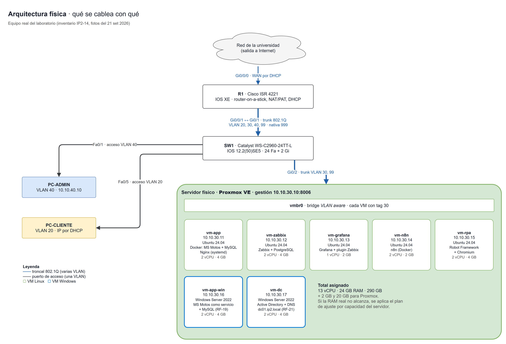
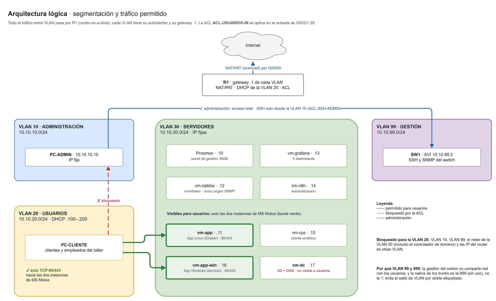
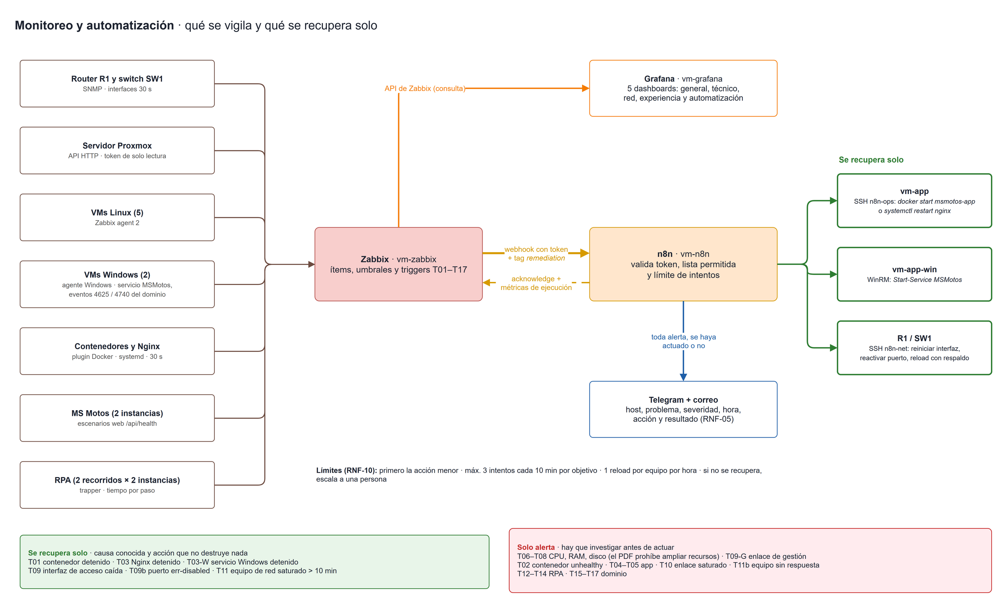

# Entregable #2 — Análisis y diseño de la solución

Este entregable define **cómo se construye** la plataforma planteada en el E1: la arquitectura física y lógica, la comparación de alternativas y la justificación de cada tecnología, siguiendo la sección 8.2 de la guía del proyecto.

Incorpora las observaciones que el profesor hizo al E1 el 21 de setiembre de 2026: la aplicación corre en **dos ambientes, Linux y Windows Server**; la identidad del personal de TI se centraliza con **Active Directory**; ante un evento de red, **la automatización reinicia la interfaz o el equipo** sin pedir autorización; hay **cinco dashboards**, el quinto sobre el estado de las automatizaciones; y **CI/CD queda fuera del alcance**.

| Pregunta orientadora de la guía | Dónde se responde |
|---|---|
| ¿Por qué se eligió cada tecnología? | Sección 4 |
| ¿Cómo se segmentará la red y qué tráfico estará permitido? | Secciones 3 y 5 |
| ¿Cómo se distribuirán los servicios entre las máquinas virtuales? | Sección 6 |
| ¿Qué métricas y umbrales serán monitoreados? | Sección 7 |
| ¿Qué fallas se automatizarán y cuáles solo generarán alertas? | Sección 8 |

La sección 12 resume las cinco respuestas en un párrafo cada una.

## 1. Resumen de la solución

La plataforma corre sobre el equipo que presta la universidad: un router **Cisco ISR 4221**, un switch **Catalyst WS-C2960-24TT-L** y un servidor físico con **Proxmox VE**. La red se divide en cuatro VLAN (Administración, Usuarios, Servidores y Gestión) más una nativa sin uso, y los usuarios solo alcanzan la aplicación.

En el servidor corren **siete máquinas virtuales**: MS Motos en Linux con Docker, MS Motos en Windows Server como servicio, Zabbix, Grafana, n8n, el robot del monitoreo sintético y el controlador de dominio. Zabbix vigila todas las capas; cuando algo se cae y la causa es conocida, n8n lo recupera y avisa por Telegram y correo; cuando el problema es de capacidad, solo avisa.

| Elemento | Cantidad |
|---|---|
| VLAN | 4 en uso (10, 20, 30, 99) + nativa 999 |
| Máquinas virtuales | 7: cinco Linux y dos Windows Server 2022 |
| Ambientes de MS Motos | 2: Linux (contenedores) y Windows (servicio nativo) |
| Triggers de Zabbix | 21: de T01 a T17, más las variantes T03-W, T09-G, T09b y T11b |
| Fallas que se recuperan solas | 6 |
| Dashboards de Grafana | 5 |
| Recorridos del cliente sintético | 2, cada uno contra las dos instancias |

### Cambios respecto al E1

| Tema | En el E1 | En este diseño | Origen |
|---|---|---|---|
| Router | Cisco 2911 (supuesto) | **ISR 4221 con IOS XE**, confirmado con fotos; cambian los nombres de interfaz, no la lógica | Inventario IP2-14 |
| Ambientes de la aplicación | Solo Linux con Docker | **Linux y Windows Server 2022** | Profesor, 21 set |
| Identidad | Cuentas locales en cada herramienta | **Active Directory** para el personal de TI | Profesor, 21 set |
| Recuperación de red | Las fallas de red solo alertaban | **Reinicio automático** de interfaz, puerto o equipo, con límites | Profesor, 21 set |
| Dashboards | 4 | **5**: se suma *Automatización* | Profesor, 21 set |
| CI/CD | Jenkins como alternativa | **Fuera del alcance** | Profesor, 21 set |
| Máquinas virtuales | 5, 16 GB de RAM | **7, 24 GB de RAM** | Consecuencia de lo anterior |

<div class="figura-h">
<h2>2. Arquitectura física</h2>
<figure><figcaption>Figura 1 · Arquitectura física. Fuente editable: docs/diagramas/arquitectura-fisica.drawio</figcaption></figure>
</div>

| Equipo | Modelo | Interfaces que se usan | Función |
|---|---|---|---|
| R1 | Cisco ISR 4221, IOS XE | Gi0/0/0 hacia la red de la universidad · Gi0/0/1 en troncal hacia SW1 | Enrutamiento entre VLAN, NAT/PAT, DHCP de usuarios, ACL |
| SW1 | Catalyst WS-C2960-24TT-L, IOS 12.2(50)SE5 | Gi0/1 troncal a R1 · Gi0/2 troncal al servidor · Fa0/1–24 acceso | VLAN, troncales, seguridad de puertos |
| Servidor | Por confirmar en la visita (IP2-14) | Una NIC en troncal a SW1 Gi0/2 | Proxmox VE y las siete VMs |
| PC-ADMIN | PC del laboratorio | SW1 Fa0/1 | Administración de toda la plataforma |
| PC-CLIENTE | PC del laboratorio | SW1 Fa0/5 | Representa a un usuario o cliente |

El módulo NIM-2T de dos seriales que trae el router no se usa. En el rack hay tres ISR 4221 y varios 2960 compartidos entre grupos, así que en la primera visita se acuerda con el profesor cuáles son del grupo y se etiquetan (riesgo R-01).

<div class="figura-h">
<h2>3. Arquitectura lógica</h2>
<figure><figcaption>Figura 2 · Segmentación y tráfico permitido. Fuente editable: docs/diagramas/arquitectura-logica.drawio</figcaption></figure>
</div>

| VLAN | Nombre | Red | Gateway | Qué hay |
|---|---|---|---|---|
| 10 | ADMINISTRACION | 10.10.10.0/24 | 10.10.10.1 | PC de administración, con IP fija |
| 20 | USUARIOS | 10.10.20.0/24 | 10.10.20.1 | PC de usuarios, DHCP de .100 a .200 |
| 30 | SERVIDORES | 10.10.30.0/24 | 10.10.30.1 | Proxmox y las siete VMs, con IP fija |
| 99 | GESTION | 10.10.99.0/24 | 10.10.99.1 | IP de gestión del switch |
| 999 | NATIVA-SIN-USO | — | — | VLAN nativa de los troncales y puertos apagados |

**Router-on-a-stick.** Todo el tráfico entre VLAN pasa por R1: el troncal Gi0/0/1 lleva una subinterfaz por VLAN, cada una con el gateway `.1` de su red. Se eligió así porque el switch, con su IOS 12.2(50)SE5, no enruta entre VLAN.

**Por qué VLAN 99 y 999.** La gestión del switch no comparte red con los usuarios, y la VLAN nativa de los troncales es la 999, que no lleva tráfico, en lugar de la 1. Así se evita el salto de VLAN por doble etiquetado.

## 4. Comparación de alternativas y justificación

### 4.1 Resumen de decisiones

| Área | Elegida | Alternativas evaluadas | Razón principal |
|---|---|---|---|
| Virtualización | **Proxmox VE** | Hyper-V, VMware ESXi, XCP-ng | Gratuito sin limitaciones, se instala directo en el servidor y trae bridge con VLAN y respaldos |
| Contenedores | **Docker + Compose** | Podman | La aplicación ya está contenerizada y probada, y el agente de Zabbix tiene plugin nativo de Docker |
| Segundo ambiente | **Windows Server nativo, como servicio** | Docker Desktop, contenedores de Windows | Es un despliegue realmente distinto, que es lo que pide el requerimiento |
| Monitoreo | **Zabbix** | — (lo exige la guía) | Una sola herramienta cubre SNMP, agentes, API HTTP y escenarios web |
| Visualización | **Grafana** con el plugin de Zabbix | Dashboards propios de Zabbix | Paneles con umbrales de color y un tablero por público |
| Automatización | **n8n** | Jenkins | Recibe webhooks de Zabbix sin plugins; Jenkins es CI/CD, fuera del alcance |
| RPA | **Robot Framework + Browser** | OpenRPA | Corre en Linux sin escritorio y mide cada paso |
| Identidad | **Active Directory** (Windows Server 2022) | Cuentas locales | Una cuenta por persona y permisos por grupo en todas las herramientas |
| Notificaciones | **Telegram + correo** | Solo correo | Telegram es inmediato; el correo queda como respaldo y registro |

Todas las herramientas son gratuitas o de código abierto. Windows Server 2022 se usa en su **versión de evaluación** de 180 días, que vence en marzo de 2027, después del cierre del curso.

### 4.2 Virtualización

| Criterio | **Proxmox VE** | Hyper-V | VMware ESXi | XCP-ng |
|---|---|---|---|---|
| Costo y licencia | Gratuito (AGPL); la suscripción solo da soporte | Requiere licencia de Windows Server; la edición gratuita se descontinuó en 2019 | Licenciamiento cambiante desde la compra por Broadcom | Gratuito (GPL) |
| Instalación en un servidor vacío | ✅ ISO propia | ⚠️ Primero hay que instalar Windows Server | ✅ ISO propia | ✅ ISO propia |
| Administración | Web integrada (puerto 8006) | Hyper-V Manager o Windows Admin Center | vSphere Client | Requiere Xen Orchestra aparte |
| VLAN hacia las VMs | ✅ Bridge *VLAN aware* | ✅ vSwitch con VLAN ID | ✅ Port groups | ✅ |
| Respaldos incluidos | ✅ `vzdump` programable | ⚠️ Windows Server Backup o terceros | ❌ Herramienta externa | ✅ Con Xen Orchestra |
| Plantilla oficial de Zabbix | ✅ *Proxmox VE by HTTP* | ✅ Plantillas de Windows | ✅ Plantillas de VMware | ⚠️ De la comunidad |

**Decisión: Proxmox VE.** Tiene costo cero sin recortes de funciones, se administra por navegador sin depender de otro sistema operativo, un solo cable en troncal lleva las VLAN a todas las VMs, y los respaldos programables mitigan los riesgos R-02 (servidor formateado) y R-09 (único servidor). **Condición:** requiere permiso para formatear el servidor; si no se autoriza, se usa el hipervisor que la universidad ya tenga instalado.

### 4.3 Contenedores y los dos ambientes de la aplicación

| Criterio | **Docker + Compose** | Podman |
|---|---|---|
| Estado actual de MS Motos | ✅ Dockerfile y Compose escritos y probados (10 pruebas, 17 set) | ⚠️ Habría que adaptar y volver a probar |
| Monitoreo con Zabbix | ✅ Plugin Docker nativo del agent 2 | ⚠️ Posible por el socket compatible, menos directo |
| Reinicio desde n8n | ✅ `docker start` con un usuario del grupo `docker` | ✅ Equivalente |
| Ejecución sin root | ⚠️ El demonio corre como root | ✅ Sin demonio |

**Decisión: Docker con Compose.** El trabajo ya está hecho y probado, y el monitoreo de contenedores sale sin desarrollo propio. La ventaja de Podman, correr sin root, se compensa limitando qué puede hacer el usuario de automatización (control C4, sección 8.4).

Para el segundo ambiente que pidió el profesor (RF-19) se compararon tres caminos:

| Opción | Valoración |
|---|---|
| **Windows Server con instalación nativa (elegida)** | Node.js y MySQL instalados en la VM y la aplicación registrada como servicio de Windows. Es un despliegue distinto al de Linux, que es lo que pide el requerimiento |
| Docker Desktop en Windows | Sería el mismo despliegue de Linux dentro de una VM anidada: no aporta nada nuevo y consume más memoria |
| Contenedores de Windows | La imagen base pesa varios GB y no hay imagen oficial de MySQL para Windows |

Así la demostración compara **contenedor detenido** (Linux) contra **servicio de Windows detenido**, con la misma aplicación.

### 4.4 Monitoreo y visualización

La guía fija **Zabbix** como herramienta de monitoreo. La justificación está en cómo se usa: una sola herramienta recoge SNMP del router y el switch, datos de los agentes en las VMs Linux y Windows, la API HTTP de Proxmox, el estado de los contenedores y escenarios web contra la aplicación, y además recibe los resultados del RPA y de n8n por *trapper*. Todo queda en una sola base con los mismos umbrales y el mismo historial.

**Grafana** se suma porque los tableros de Zabbix están pensados para operadores. Grafana permite paneles con colores de umbral y un tablero para cada público, desde el ejecutivo que solo quiere saber si el servicio está bien hasta el técnico que busca el cuello de botella. Consulta a Zabbix con un usuario de solo lectura.

### 4.5 Automatización

| Criterio | **n8n** | Jenkins |
|---|---|---|
| Recibir alertas de Zabbix | ✅ Nodo Webhook nativo | ⚠️ Plugin y token de *build* remoto |
| Ejecutar acciones en VMs y equipos de red | ✅ Nodos SSH y WinRM | ✅ Agentes o `sh` por SSH |
| Telegram y correo | ✅ Nodos nativos | ⚠️ Plugins |
| Lógica condicional (etiquetas, reintentos) | ✅ Visual | ⚠️ Groovy |
| Consumo | Bajo, unos 300 MB | Alto, JVM de alrededor de 1 GB |

**Decisión: n8n.** Jenkins es una herramienta de integración y entrega continua, y el profesor indicó el 21 de setiembre que CI/CD no forma parte de este proyecto.

### 4.6 Monitoreo sintético (RPA)

| Criterio | **Robot Framework + Browser** | OpenRPA |
|---|---|---|
| Sistema operativo | ✅ Linux sin interfaz gráfica | ❌ Windows con escritorio |
| Programación | ✅ `systemd timer` | ⚠️ Requiere OpenFlow |
| Versionado en Git | ✅ Archivos de texto `.robot` | ⚠️ Formato propio |
| Tiempo por paso | ✅ `output.xml` con el tiempo de cada palabra clave | ⚠️ Manual |

**Decisión: Robot Framework con Browser Library** (Playwright y Chromium). Corre en una VM Linux pequeña, el código queda versionado y cada paso sale medido sin trabajo extra.

### 4.7 Identidad y acceso

El profesor pidió Active Directory para la validación de usuarios y la seguridad. Las decisiones de diseño fueron:

| Decisión | Por qué |
|---|---|
| Solo el **personal de TI** entra al dominio | Los clientes de MS Motos siguen con su cuenta del portal, que vive en la base de datos de la aplicación |
| Dominio **`ip2.local`** | La plataforma es interna y no se publica en Internet: no hace falta un dominio comprado |
| Un controlador de dominio **en su propia VM** | Si se juntara con la aplicación Windows, una sola caída tumbaría el segundo ambiente y la identidad |
| **n8n queda con cuenta local** | Su integración con LDAP es de la edición de pago. Se documenta como exclusión |
| Cuentas locales **de emergencia** en cada herramienta | Si el dominio cae, alguien tiene que poder entrar a arreglarlo (riesgo R-14) |

## 5. Diseño de red: segmentación y tráfico permitido

### 5.1 Direcciones fijas

| Equipo | VLAN | IP | Observación |
|---|---|---|---|
| R1 | 10, 20, 30, 99 | `.1` de cada red | Gateway de cada VLAN |
| SW1 | 99 | 10.10.99.2 | SSH y SNMP del switch |
| PC-ADMIN | 10 | 10.10.10.10 | |
| Proxmox | 30 | 10.10.30.10 | Panel web en el puerto 8006 |
| vm-app | 30 | 10.10.30.11 | MS Motos en Linux; visible para usuarios en 80/443 |
| vm-zabbix | 30 | 10.10.30.12 | Único origen SNMP permitido |
| vm-grafana | 30 | 10.10.30.13 | |
| vm-n8n | 30 | 10.10.30.14 | Único origen SSH de automatización hacia los equipos de red |
| vm-rpa | 30 | 10.10.30.15 | Recorre las dos instancias |
| vm-app-win | 30 | 10.10.30.16 | MS Motos en Windows; visible para usuarios en 80/443 |
| vm-dc | 30 | 10.10.30.17 | Active Directory y DNS; **no** visible para usuarios |

### 5.2 Puertos del switch

| Puerto | Modo | VLAN | Conecta a |
|---|---|---|---|
| Gi0/1 | Troncal | 10, 20, 30, 99 · nativa 999 | R1 Gi0/0/1 |
| Gi0/2 | Troncal | 30, 99 · nativa 999 | Servidor Proxmox |
| Fa0/1 – Fa0/4 | Acceso | 10 | PC de administración |
| Fa0/5 – Fa0/12 | Acceso | 20 | PC de usuarios |
| Fa0/13 – Fa0/20 | Acceso | 30 | Reservados para servidores |
| Fa0/21 – Fa0/24 | Apagados | 999 | Sin uso |

Todos los puertos de acceso llevan `spanning-tree portfast` y `bpduguard`. Los de usuarios, además, seguridad de puerto con un máximo de dos direcciones MAC en modo *restrict*.

### 5.3 Tráfico permitido entre VLAN

Se implementa con la ACL extendida `ACL-USUARIOS-IN`, aplicada en la entrada de la subinterfaz de la VLAN 20.

| Origen ↓ · Destino → | Administración (10) | Usuarios (20) | Servidores (30) | Gestión (99) | Internet |
|---|---|---|---|---|---|
| **Administración (10)** | ✅ | ✅ | ✅ Todo | ✅ | ✅ |
| **Usuarios (20)** | ❌ | ✅ | ⚠️ **Solo 10.10.30.11 y 10.10.30.16, TCP 80/443** | ❌ | ✅ |
| **Servidores (30)** | ✅ | ✅ Respuestas | ✅ | ✅ SNMP desde Zabbix | ✅ |

La ACL permite además el DHCP y el ping al gateway de la VLAN 20, las respuestas a conexiones que abrió Administración (soporte remoto), y bloquea explícitamente las IP del router en las otras VLAN, para que un usuario no lo administre por otra dirección.

### 5.4 Controles en los equipos

| Control | Dónde | Detalle |
|---|---|---|
| SSH solo desde Administración | R1 y SW1 | `access-class ACL-SSH-ADMIN` en las líneas VTY; Telnet deshabilitado |
| SNMP solo desde Zabbix | R1 y SW1 | Comunidad de solo lectura restringida a 10.10.30.12 |
| NAT/PAT | R1 Gi0/0/0 | Todas las VLAN internas salen con la IP de la WAN |
| DHCP | R1 | Solo para la VLAN 20 |
| Contraseñas | R1 y SW1 | `enable secret`, usuario local con `secret` y `service password-encryption`. Las reales no están en el repositorio: los archivos versionados llevan `CAMBIAR-` |

**Condición del SSH:** solo existe si la imagen del IOS incluye `k9`. Se verifica con `show version` en la primera visita; si el switch no la trae, se administra por consola y se documenta como limitación.

### 5.5 Ensayo en Packet Tracer

Las configuraciones se ensayaron en Packet Tracer antes de tocar el equipo real, para llegar al laboratorio con ellas probadas (riesgo R-03).

| Ensayo | Resultado |
|---|---|
| 17 set · con un 2911 | V1 y V3 a V9 correctas: DHCP, bloqueos hacia Administración, Servidores y Gestión, SSH desde Administración, NAT y salida a Internet |
| 24 set · con ISR4321 y los dos servidores nuevos | Topología completa, 10 equipos y 8 enlaces, sin enlaces caídos ni IP duplicadas. **Falta repetir las validaciones**, incluidas las nuevas V10 (usuarios llegan a la instancia Windows) y V11 (usuarios no llegan al controlador de dominio) |

En Packet Tracer el ISR 4221 se representa con un **ISR4321**, que usa los mismos nombres de interfaz, así que la misma configuración sirve para el ensayo y para el laboratorio.

## 6. Distribución de servicios en las máquinas virtuales

### 6.1 Las siete VMs

| VM | IP | Sistema | Servicios | vCPU | RAM | Disco |
|---|---|---|---|---|---|---|
| vm-app | .11 | Ubuntu Server 24.04 | Nginx (systemd), Docker: MS Motos + MySQL 8.4 | 2 | 4 GB | 40 GB |
| vm-zabbix | .12 | Ubuntu Server 24.04 | Zabbix server + frontend + PostgreSQL | 2 | 4 GB | 60 GB |
| vm-grafana | .13 | Ubuntu Server 24.04 | Grafana + plugin de Zabbix | 1 | 2 GB | 20 GB |
| vm-n8n | .14 | Ubuntu Server 24.04 | n8n (Docker) | 2 | 2 GB | 20 GB |
| vm-rpa | .15 | Ubuntu Server 24.04 | Robot Framework + Chromium sin interfaz | 2 | 4 GB | 30 GB |
| vm-app-win | .16 | Windows Server 2022 | MS Motos como servicio + MySQL 8.4 | 2 | 4 GB | 60 GB |
| vm-dc | .17 | Windows Server 2022 | Active Directory (AD DS) + DNS | 2 | 4 GB | 60 GB |
| **Total** | | | | **13** | **24 GB** | **290 GB** |

Proxmox necesita además unos 2 GB de RAM y 20 GB de disco para sí mismo. El servidor ideal tiene **8 núcleos o más, 32 GB de RAM y 350 GB de disco**.

### 6.2 Por qué se repartió así

| Decisión | Motivo |
|---|---|
| Zabbix en su propia VM | El monitoreo no puede caer junto con lo que monitorea. Es además la fuente de todos los tableros: nunca se apaga para liberar memoria |
| n8n separado de la aplicación | Si la VM de la aplicación se degrada, la automatización sigue ahí para recuperarla |
| El RPA en una VM aparte | El navegador es lo que más memoria consume; aislado, no le roba recursos a la aplicación y mide como lo haría un cliente de afuera |
| Grafana separado de Zabbix | Es lo que primero se une a Zabbix si falta memoria (6.3): la separación es preferible, no imprescindible |
| Nginx como servicio del sistema, no contenedor | Así la prueba de *servicio detenido* (PR-01) es distinta de la de *contenedor detenido* (PR-02) |
| El controlador de dominio solo | Ver 4.7 |

### 6.3 Si el servidor tiene menos recursos

La RAM real del servidor se conoce en la primera visita (IP2-14). El ajuste se decide ahí mismo:

| RAM del servidor | Ajuste | RAM asignada |
|---|---|---|
| 32 GB o más | La tabla 6.1 completa | 24 GB |
| 24 a 32 GB | Grafana se une a `vm-zabbix` (5 GB) y `vm-rpa` baja a 3 GB | 21 GB |
| 16 a 24 GB | Además, n8n pasa a contenedor en `vm-zabbix` y `vm-app-win` baja a 3 GB | ~17 GB |
| Menos de 16 GB | La aplicación Windows y el controlador de dominio van en **una sola VM** | La opción menos deseable (ver 4.7); se justifica en el informe |

**Si falta memoria durante una demostración,** se apaga primero `vm-rpa` y después `vm-n8n`. Nunca `vm-zabbix`.

### 6.4 Redes virtuales

| Elemento | Configuración |
|---|---|
| Interfaz física del servidor | Conectada a SW1 Gi0/2 en troncal (VLAN 30 y 99, nativa 999) |
| Bridge de Proxmox | `vmbr0` con **VLAN aware** activado |
| Gestión de Proxmox | 10.10.30.10/24, gateway 10.10.30.1 |
| Tarjeta de cada VM | En `vmbr0` con **etiqueta VLAN 30** |
| DNS de las VMs unidas al dominio | 10.10.30.17 (`vm-dc`), que reenvía a 8.8.8.8 lo que no es del dominio |

### 6.5 Los dos ambientes de MS Motos

| Tema | Linux (`vm-app`) | Windows (`vm-app-win`) |
|---|---|---|
| Ejecución | Docker Compose: contenedores `msmotos-app` y `msmotos-db` | Node.js como servicio de Windows `MSMotos` + MySQL instalado |
| Entrada de los usuarios | Nginx en el puerto 80, que reenvía a la app en `127.0.0.1:3000` | Node escucha directo en el puerto 80 |
| Base de datos | Contenedor, solo accesible en la red interna de Docker; datos en el volumen `msmotos-db-data` | MySQL local en `127.0.0.1:3306` |
| Falla que se recupera sola | Contenedor detenido (PR-02) y Nginx detenido (PR-01) | Servicio `MSMotos` detenido |
| Tareas programadas | Activas | Desactivadas (`DISABLE_CRON=1`), para que no se dupliquen recordatorios ni cierres automáticos |
| Datos | Independientes | Independientes: las dos instancias no se replican |
| Monitoreo | Agent 2 + plugin de Docker | Agente de Windows + estado del servicio |

**Política de reinicio de Docker:** `restart: unless-stopped`. Levanta la aplicación si se cae sola, pero **no** si alguien la detiene con `docker stop`. Ese caso es el que detecta Zabbix y recupera n8n: si Docker lo resolviera solo, la prueba de la guía no mostraría nada. En Windows, por la misma razón, la recuperación automática del propio servicio queda desactivada.

**Variables y secretos:** cada ambiente tiene su archivo de entorno con contraseñas distintas y su propio secreto de sesión. Ninguno se sube a Git.

### 6.6 Identidad con Active Directory

| Dato | Valor |
|---|---|
| Dominio | `ip2.local` (NetBIOS `IP2`) |
| Controlador | `dc01.ip2.local` en `vm-dc`, con los roles AD DS y DNS |
| Unidades organizativas | `OU=IP2` con Usuarios, Servicios y Equipos |
| Cuentas | Una por integrante; `svc-ldap` de solo lectura para las consultas de las herramientas |
| **GG-IP2-Administradores** | Stiff, Alexander y Angel: acceso total |
| **GG-IP2-Operadores** | Jeffrey y Álvaro: solo lectura en Zabbix y Grafana |

Los permisos se dan **al grupo, nunca a la persona**: sumar a alguien al equipo es meterlo al grupo, y sacarlo es quitarlo de ahí.

| Sistema | Cómo valida contra el dominio |
|---|---|
| Servidor Windows de la aplicación | Unido al dominio |
| Proxmox | Dominio de autenticación de tipo Active Directory |
| Zabbix y Grafana | LDAP, con los grupos del dominio mapeados a sus roles |
| SSH de las VMs Linux | SSSD (`realm join`); solo el grupo de administradores inicia sesión |
| n8n | Cuenta local (ver 4.7) |

**Política de grupo (RNF-09):** contraseñas de 12 caracteres o más con complejidad, vigencia de 90 días, historial de 5, **bloqueo a los 5 intentos fallidos** durante 15 minutos, y auditoría de los inicios de sesión.

### 6.7 Respaldos

| Qué | Frecuencia | Retención |
|---|---|---|
| `vm-app`, `vm-zabbix`, `vm-dc` | Diario, de madrugada | 3 copias |
| `vm-app-win` | Diario | 2 copias |
| `vm-grafana`, `vm-n8n`, `vm-rpa` | Semanal | 2 copias |
| Dashboards, flujos, plantillas y configuraciones de red | En cada cambio | Historial completo en GitHub |

Los respaldos de VMs van a un disco externo o a un almacenamiento distinto del servidor. Se prueba una restauración antes del E3.

<div class="figura-h">
<h2>7. Monitoreo: métricas y umbrales</h2>
<figure><figcaption>Figura 3 · Qué vigila Zabbix y qué recupera n8n. Fuente editable: docs/diagramas/flujo-monitoreo.drawio</figcaption></figure>
</div>

### 7.1 Qué se monitorea y cómo

| Capa | Método | Intervalo |
|---|---|---|
| Servidor físico | API HTTP de Proxmox con token de solo lectura (plantilla *Proxmox VE by HTTP*) | 60 s |
| VMs Linux | Zabbix agent 2 en modo activo | 60 s |
| VMs Windows | Agente de Zabbix para Windows | 60 s |
| Contenedores | Plugin Docker del agent 2 | 30 s |
| Servicios | Estado de Nginx en systemd y del servicio `MSMotos` en Windows | 30 s |
| Aplicación | Escenarios web contra `/api/health` de cada instancia, con tiempo de respuesta | 60 s |
| Seguridad del dominio | Registro de seguridad de Windows: eventos 4625 (inicio fallido) y 4740 (cuenta bloqueada) | 60 s |
| Router y switch | SNMP (plantilla *Cisco IOS by SNMP*) | 60 s; interfaces 30 s |
| Conectividad | Ping desde Zabbix a R1, SW1 y Proxmox | 30 s |
| Experiencia del cliente | Resultados del RPA enviados por *trapper*, un host por instancia | En cada ejecución |
| Automatización | Resultados de cada ejecución de n8n, por *trapper* | En cada ejecución |

**Por qué 30 segundos en algunos ítems:** son los de la demostración (contenedor, servicios, interfaces). Con ese intervalo la detección tarda menos de 2 minutos (RNF-01). El resto va a 60 segundos para no llenar la base de historial.

### 7.2 Umbrales y triggers

La columna *Acción* anticipa la sección 8: la etiqueta `remediation` del trigger es lo que le dice a n8n qué hacer.

| # | Trigger | Condición | Severidad | Acción |
|---|---|---|---|---|
| T01 | Contenedor `msmotos-app` detenido | Estado distinto de *running* durante 1 min | High | **Se recupera sola** |
| T02 | Contenedor *unhealthy* | Health = unhealthy durante 2 min | High | Alerta |
| T03 | Nginx detenido (Linux) | Servicio inactivo durante 1 min | High | **Se recupera sola** |
| T03-W | Servicio `MSMotos` detenido (Windows) | Servicio detenido durante 1 min | High | **Se recupera sola** |
| T04 | Aplicación no disponible | `/api/health` distinto de 200 en 2 lecturas seguidas | Disaster | Alerta |
| T05 | Aplicación lenta | Login con más de 2 s de promedio en 5 min | Warning | Alerta |
| T06 | CPU alta | Más de 85 % en 5 min (Warning) · más de 95 % (High) | Warning / High | **Solo alerta** |
| T07 | Memoria alta | Menos de 15 % libre en 5 min (Warning) · menos de 5 % (High) | Warning / High | **Solo alerta** |
| T08 | Disco lleno | Más de 80 % (Warning) · más de 90 % (High) | Warning / High | **Solo alerta** |
| T09 | Interfaz de acceso caída o con errores | Caída 2 min, o errores y descartes sobre el umbral | High | **Se recupera sola** |
| T09-G | Enlace de gestión caído | Troncal, enlace al servidor o WAN caídos 1 min | Disaster | **Solo alerta** |
| T09b | Puerto en *err-disabled* | Bloqueado por seguridad de puerto | Warning | **Se recupera sola** |
| T10 | Enlace saturado | Más de 70 % en 5 min (Warning) · más de 90 % (High) | Warning / High | Alerta |
| T11 | Router o switch saturado | CPU o memoria sobre 90 % durante 10 min | High | **Se recupera sola**, con respaldo previo |
| T11b | Equipo sin respuesta | Sin respuesta al ping durante 2 min | Disaster | Alerta |
| T12 | RPA falló | Cualquier recorrido terminó en fallo | High | Alerta con el paso donde falló |
| T13 | RPA lento | Consulta sobre 10 s o agendamiento sobre 20 s | Warning | Alerta |
| T14 | RPA sin datos | Sin resultados de consulta en 15 min o de agendamiento en 75 min | Warning | Alerta |
| T15 | Controlador de dominio caído | AD DS o DNS detenidos, o la VM sin responder 2 min | Disaster | Alerta |
| T16 | Inicios de sesión fallidos | Más de 10 en 5 min | Warning | Alerta |
| T17 | Cuenta bloqueada | Cualquier bloqueo | Warning | Alerta con el nombre de la cuenta |

### 7.3 Dashboards de Grafana

Cada panel responde una pregunta concreta y usa colores de umbral, no solo gráficas.

| Dashboard | Pregunta que responde | Qué muestra |
|---|---|---|
| **General** | ¿El servicio está bien? | Disponibilidad en 24 h y 7 días, estado por componente, problemas activos, recuperaciones del día, tiempo de respuesta |
| **Técnico** | ¿Dónde está el cuello de botella? | CPU, RAM y disco del servidor y de cada VM, estado y consumo de los contenedores, Nginx |
| **Red** | ¿La red está sana? | Estado de las interfaces de R1 y SW1, tráfico con umbrales de 70 y 90 %, errores y descartes, latencia |
| **Experiencia del cliente** | ¿Qué vive el cliente? | Resultado y duración de cada recorrido del RPA por instancia, tiempo por paso, tasa de éxito, último error |
| **Automatización** | ¿Los procesos automáticos funcionan? | Resultado de cada flujo de n8n, recuperaciones por tipo, tiempo hasta la recuperación con el umbral de 5 min, rechazos y escalamientos, ejecuciones del RPA |

Si alguno queda cargado, se divide; por ejemplo el técnico, en *Servidor y VMs* y *Contenedores y servicios*.

### 7.4 El cliente sintético

El RPA es un **cliente de MS Motos** que usa el portal de clientes, como pidió el profesor, no un empleado del taller. Su cuenta la crea el script de carga inicial en las dos instancias, con una moto y un historial de prueba.

| Recorrido | Frecuencia | Pasos | Umbral |
|---|---|---|---|
| **Consulta** (RF-16) | Cada 5 min | Abrir el portal, iniciar sesión, leer el inicio, ver sus motos y el historial, revisar sus órdenes, cerrar sesión | 10 s |
| **Agendar una cita** (RF-17) | Cada 30 min | Iniciar sesión, elegir sucursal y servicio, reservar el próximo espacio libre, verificar la cita en *Mis citas*, cancelarla, cerrar sesión | 20 s |

**Por qué cancela la cita en el mismo recorrido:** para no ocupar nunca un espacio real de la agenda del taller. Si el recorrido falla después de reservar, un paso de limpieza final cancela la cita que haya quedado abierta.

De cada ejecución se envían a Zabbix el resultado, la duración total, la duración de cada paso, el paso que falló y el mensaje de error (RF-18).

## 8. Automatización: qué se recupera solo y qué solo alerta

### 8.1 Criterio

Una falla se recupera sola **solo si se cumplen las cuatro condiciones**:

| Condición | Se recupera sola | Solo alerta |
|---|---|---|
| Causa conocida y acción segura | ✅ Levantar lo que se cayó o reiniciar una interfaz no destruye nada | ❌ Hay que investigar antes de actuar |
| Resultado verificable | ✅ Zabbix confirma que volvió a estar arriba | ❌ Asignar recursos o tocar cuentas esconde el problema |
| Lo permite la guía | ✅ Sección 5.4 y la observación del profesor sobre la red | ❌ La guía prohíbe ampliar recursos automáticamente |
| La acción es alcanzable | ✅ El equipo responde por la red | ❌ Si el equipo o el camino no responden, no hay acción posible |

### 8.2 Falla, acción y validación

| Falla | Trigger | Acción automática | Valida |
|---|---|---|---|
| Contenedor detenido | T01 | n8n → SSH a `vm-app` → `docker start msmotos-app` | Zabbix cierra el problema y el RPA vuelve a OK |
| Nginx detenido | T03 | n8n → SSH a `vm-app` → `systemctl restart nginx` | Zabbix cierra el problema |
| Servicio de Windows detenido | T03-W | n8n → WinRM a `vm-app-win` → `Start-Service MSMotos` | Zabbix cierra el problema |
| Interfaz de acceso caída o con errores | T09 | n8n → SSH al equipo → `shutdown` / `no shutdown` de esa interfaz | Zabbix cierra el problema |
| Puerto en *err-disabled* | T09b | n8n → SSH → reactivar el puerto | Zabbix cierra el problema |
| Router o switch saturado | T11 | n8n → guardar la configuración → `reload` | Zabbix cierra el problema |
| CPU, RAM o disco altos | T06–T08 | **Ninguna** | Intervención humana |
| Enlace de gestión caído | T09-G | **Ninguna** | Intervención humana |
| Aplicación caída o lenta, enlace saturado, RPA, dominio | T04–T05, T10, T12–T17 | **Ninguna** | Intervención humana |

En todos los casos, se haya actuado o no, n8n avisa por Telegram y correo.

### 8.3 Recuperación automática de la red

| Evento | Acción | Espera antes de actuar |
|---|---|---|
| Interfaz de acceso caída o con errores | Reiniciar solo esa interfaz | 2 minutos, para no actuar si alguien solo desconectó un cable un momento |
| Puerto en *err-disabled* | Reactivar solo ese puerto | Inmediato |
| CPU o memoria del equipo saturadas | Respaldar la configuración y reiniciar el equipo | 10 minutos sostenidos |

**Lo que nunca se reinicia solo:** el troncal R1↔SW1, el enlace al servidor y la WAN. Si n8n hiciera `shutdown` en uno de esos, perdería el camino hacia el equipo y no podría ejecutar el `no shutdown` que lo levanta. Esos enlaces solo generan alerta (T09-G).

**Límites (RNF-10):** primero la acción menor y el reinicio del equipo solo si la saturación persiste; máximo 3 intentos por interfaz cada 10 minutos y un reinicio por equipo por hora. Si no se recupera, se escala a una persona y la automatización no vuelve a intentar.

**Cuenta de automatización en la red:** `n8n-net`, local en el router y el switch, con SSH permitido solo desde `vm-n8n` y un nivel de privilegio que habilita únicamente entrar a una interfaz, `shutdown`, `no shutdown`, guardar la configuración y `reload`.

### 8.4 Controles de seguridad

| # | Control | Evita |
|---|---|---|
| C1 | **Lista cerrada de acciones:** n8n solo conoce comandos fijos, y el objetivo sale de una lista, nunca del texto de la alerta | Ejecución de comandos inyectados |
| C2 | **Límite de reintentos:** 3 por objetivo cada 10 minutos | Reinicios en bucle (riesgo R-12) |
| C3 | **Escalamiento a una persona** al agotar el límite | Que la automatización oculte una falla de fondo |
| C4 | **Usuario restringido** en `vm-app`: llave SSH sin contraseña y `sudo` solo para reiniciar Nginx | Escalada de privilegios si se compromete n8n |
| C5 | **Webhook autenticado** con token; n8n solo accesible desde la VLAN 30 | Que alguien dispare acciones desde fuera |
| C6 | **Trazabilidad:** cada acción queda en el historial de n8n y como comentario en el evento de Zabbix | Acciones sin registro |
| C7 | **Interruptor de emergencia:** desactivar el flujo detiene toda acción sin afectar las alertas | Pérdida de control durante una falla mayor |
| C8 | **Lista blanca de interfaces:** solo puertos de acceso; los de gestión están excluidos por nombre | Cortar el acceso de la propia automatización |
| C9 | **Respaldo antes del `reload`** | Perder la configuración del equipo |
| C10 | **Ensayo previo en Packet Tracer** | Probar por primera vez sobre el equipo real (riesgo R-15) |
| C11 | **Ventana de prueba:** las pruebas de red se hacen en horario de laboratorio, nunca durante una demostración | Interrumpir una presentación |

### 8.5 Notificaciones

| Canal | Uso |
|---|---|
| Telegram | Principal e inmediato: un bot en el grupo del equipo |
| Correo | Respaldo y registro formal, con una cuenta dedicada |

Cada alerta dice el host, el problema, la severidad, desde cuándo, qué acción automática se tomó y qué revisar si no se recupera (RNF-05):

```
🔴 [HIGH] Contenedor msmotos-app detenido
Host: vm-app (10.10.30.11)
Desde: 2026-11-03 10:42:15 (hace 1 min)
Acción automática: reinicio del contenedor (intento 1 de 3)
Qué revisar si no se recupera: docker compose logs app
Evento Zabbix: #12345
```

Si la red de la universidad bloquea Telegram o el correo, se detecta en la primera visita (riesgo R-04).

## 9. Trazabilidad: de los requerimientos al diseño

| Requerimiento | Cómo lo resuelve el diseño | Sección |
|---|---|---|
| RF-01 · NAT/PAT | Sobrecarga en R1 Gi0/0/0 para las cuatro VLAN | 5.4 |
| RF-02 · VLAN y troncales | VLAN 10, 20, 30 y 99; troncales hacia R1 y el servidor | 3, 5.2 |
| RF-03 · Enrutamiento entre VLAN | Router-on-a-stick en R1 | 3 |
| RF-04 · Usuarios sin acceso a la infraestructura | `ACL-USUARIOS-IN` y SSH solo desde Administración | 5.3, 5.4 |
| RF-05 · Hipervisor y VMs | Proxmox VE y siete VMs dimensionadas | 4.2, 6.1 |
| RF-06 · Contenedores | Dockerfile y Compose de MS Motos | 4.3, 6.5 |
| RF-07 · Persistencia, redes, variables y puertos | Volumen, red interna de Docker, archivo de entorno, puertos | 6.5 |
| RF-08 · Zabbix monitorea todas las capas | Servidor, VMs, contenedores, servicios, aplicación, router, switch | 7.1 |
| RF-09 · Métricas | CPU, memoria, disco, red, latencia, disponibilidad y tiempo de respuesta | 7.1 |
| RF-10 · Triggers con umbrales | T01 a T17, incluidas caída y saturación de interfaces | 7.2 |
| RF-11 · Cinco dashboards | General, técnico, red, experiencia y automatización | 7.3 |
| RF-12 · Servicio detenido | T03 y T03-W | 8.2 |
| RF-13 · Contenedor detenido | T01 | 8.2 |
| RF-14 · Capacidad solo alerta | T06 a T08 sin acción automática | 8.1, 8.2 |
| RF-15 · Telegram y correo | Nodos de n8n | 8.5 |
| RF-16 y RF-17 · Recorridos del cliente | Consulta cada 5 min y agendamiento cada 30 min | 7.4 |
| RF-18 · Resultados del RPA a Zabbix | Resultado, duración total y por paso, paso y error | 7.4 |
| RF-19 · Dos ambientes | `vm-app` (Linux) y `vm-app-win` (Windows) | 4.3, 6.5 |
| RF-20 · Monitoreo de ambos | Escenarios web, contenedor o servicio, y recursos de cada VM | 7.1 |
| RF-21 · Active Directory | `vm-dc` con AD DS y DNS | 4.7, 6.6 |
| RF-22 · Las herramientas validan contra el dominio | Windows, Proxmox, Zabbix, Grafana y SSH | 6.6 |
| RF-23 · Recuperación automática de la red | T09, T09b y T11 | 8.3 |
| RNF-01 · Detectar en 2 min o menos | Intervalos de 30 s y triggers de 1 a 2 min | 7.1 |
| RNF-02 · Recuperar en 5 min o menos | Acción inmediata tras el trigger; medido en el tablero de automatización | 7.3, 8.2 |
| RNF-03 · Automatizaciones seguras | Controles C1 a C3 | 8.4 |
| RNF-04 · Trazabilidad | Control C6 | 8.4 |
| RNF-05 · Alertas accionables | Formato de alerta | 8.5 |
| RNF-06 · Seguridad | Sin credenciales en Git, SNMP restringido, privilegios mínimos | 5.4, 8.4 |
| RNF-07 · Reproducibilidad | Configuraciones, dashboards y flujos versionados en GitHub | 6.7 |
| RNF-09 · Seguridad de las cuentas | Política de grupo del dominio y triggers T16 y T17 | 6.6, 7.2 |
| RNF-10 · Reinicios de red controlados | Orden, límites y exclusiones | 8.3 |

RNF-08 (gestión del proyecto) no es de diseño: se sigue en Jira y en las minutas semanales.

## 10. Qué ya está validado y qué es todavía diseño

Este documento es un diseño, pero una parte ya se construyó y se probó fuera del laboratorio, en una réplica local con Docker y en Packet Tracer. Se distingue para que ninguna decisión se lea como probada si no lo está.

| Componente | Estado | Evidencia |
|---|---|---|
| MS Motos en contenedores | ✅ **Probado** · 17 set | 10 pruebas: construcción, esquema y migraciones, siembra de cuentas, persistencia tras reiniciar, contenedor detenido que no vuelve solo, caída de procesos internos |
| Recuperación de un contenedor detenido (PR-02) | ✅ **Probado** · 17 set, dos corridas | Detección a los **83 s y 114 s**, recuperación en **menos de 3 s** tras la detección, evento cerrado a los 142 s y 173 s. Cumple RNF-01 y RNF-02 |
| Controles de la automatización | ✅ **Probado** · 17 set | Webhook con token inválido descartado; el usuario restringido puede iniciar la aplicación y **no** puede listar contenedores ni detener la base |
| Dashboards general, técnico, red y experiencia | ✅ **Probados** · 17 set | 20 de 29 paneles de métricas con datos; los 9 restantes esperan el router, el switch y el RPA, que solo existen con el equipo real |
| Configuración de red | ⚠️ **Ensayada en Packet Tracer** | Validaciones V1 y V3 a V9 correctas el 17 set; la topología actualizada del 24 set está pendiente de repetirlas |
| Dashboard de automatización | ⚠️ **Construido, sin cargar** | 7 paneles; falta verlo en Grafana con datos |
| Servicio detenido (PR-01), ambiente Windows, recuperación de red, RPA, Active Directory | 📐 **Solo diseño** | Se implementan en el E3 |

## 11. Riesgos del diseño y decisiones pendientes

| Pendiente | Qué decide | Cuándo |
|---|---|---|
| **RAM real del servidor** | Si se aplica la tabla 6.1 completa o uno de los ajustes de 6.3 | Primera visita al laboratorio (IP2-14) |
| Imagen del IOS con `k9` | Si hay SSH en el switch o se administra por consola | Primera visita, con `show version` |
| Permiso para formatear el servidor | Si se instala Proxmox o se usa el hipervisor existente | Consulta al profesor |
| Dirección WAN por DHCP | Si R1 recibe salida a Internet directamente | Primera visita (riesgo R-05) |
| Telegram y correo desde la red de la universidad | Si las notificaciones salen o se usa otro canal | Primera visita (riesgo R-04) |
| Equipos asignados al grupo | Cuál router y cuál switch del rack son del grupo | Primera visita (riesgo R-01) |

Ninguno cambia la arquitectura: el que más impacto puede tener es la RAM, y su respuesta ya está planificada en 6.3.

## 12. Respuestas a las preguntas orientadoras

**¿Por qué se eligió cada tecnología?** Por costo cero sin limitaciones, porque cada una resuelve su parte sin desarrollo propio y porque encajan entre sí: Proxmox lleva las VLAN a las VMs por un solo troncal, Docker ya tenía la aplicación probada, Zabbix concentra todas las fuentes, Grafana presenta un tablero por público, n8n recibe las alertas de Zabbix sin plugins y Robot Framework mide cada paso del cliente sintético. Las alternativas descartadas y el motivo están en la sección 4.

**¿Cómo se segmentará la red y qué tráfico estará permitido?** En cuatro VLAN (Administración, Usuarios, Servidores y Gestión) con una nativa sin uso, enrutadas por R1. Los usuarios solo llegan a las dos instancias de MS Motos por HTTP y HTTPS, y a Internet; Administración llega a todo y es la única desde la que se entra por SSH a los equipos. Secciones 3 y 5.

**¿Cómo se distribuirán los servicios entre las máquinas virtuales?** En siete VMs, una por servicio, para que el monitoreo y la automatización no caigan con lo que vigilan: dos para la aplicación (Linux y Windows), una para Zabbix, una para Grafana, una para n8n, una para el RPA y una para el controlador de dominio. Si la RAM del servidor no alcanza, hay un plan escalonado para juntar servicios. Sección 6.

**¿Qué métricas y umbrales serán monitoreados?** Disponibilidad, CPU, memoria, disco, tráfico, errores de interfaz, latencia, estado de contenedores y servicios, tiempo de respuesta de la aplicación, duración de cada paso del cliente sintético y eventos de seguridad del dominio, con 21 triggers y sus umbrales en la sección 7.

**¿Qué fallas se automatizarán y cuáles solo generarán alertas?** Se recuperan solos el contenedor detenido, Nginx y el servicio de Windows detenidos, la interfaz de acceso caída, el puerto bloqueado y el equipo de red saturado, porque su causa es conocida y la acción no destruye nada. Los problemas de capacidad, los enlaces de gestión, la aplicación lenta, el RPA y el dominio solo alertan, porque hay que investigarlos antes de actuar. Sección 8.

## 13. Próximos pasos hacia el E3 (2 de noviembre)

| Paso | Tareas |
|---|---|
| Inventario del servidor y configuración de R1 y SW1 en el laboratorio | IP2-14, IP2-27, IP2-28, IP2-29 |
| Instalar Proxmox y crear las siete VMs | IP2-32, IP2-33, IP2-73, IP2-79 |
| Desplegar MS Motos en los dos ambientes | IP2-38, IP2-74 |
| Zabbix con todos los hosts, incluidos router y switch por SNMP | IP2-41 a IP2-45, IP2-75 |
| Dominio, política de grupo e integración de las herramientas | IP2-80, IP2-81, IP2-82 |
| Flujos de n8n, incluida la recuperación de red | IP2-50 a IP2-53, IP2-85, IP2-86 |
| Cliente sintético contra las dos instancias | IP2-56, IP2-76 |

Las configuraciones, los dashboards y los flujos ya están versionados en el repositorio, así que la construcción del E3 parte de lo diseñado y probado aquí.
